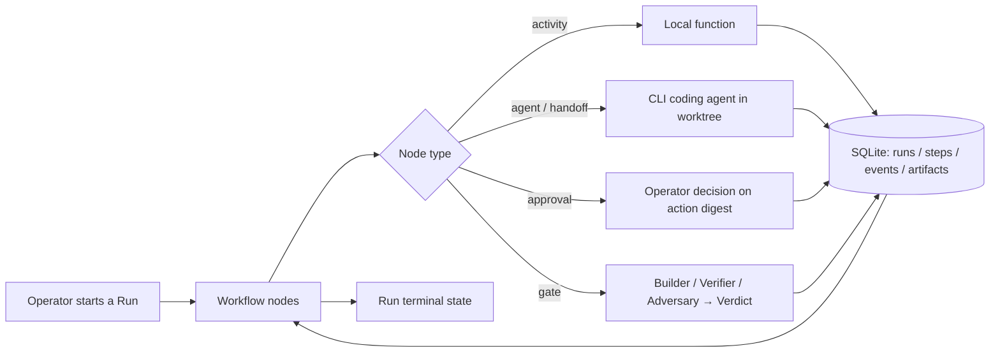

# 🤖 JARVIS-AWF

## 📋 Description

JARVIS-AWF is the reference implementation of the Agentic Workflow Fabric (AWF): a durable, local-first control system for running AI coding/research agents against explicit, versioned Workflow definitions. It is built and used by one operator, on their own machines.

The unit of operation is a Run of a versioned Workflow Definition. Agents are bounded executors inside a Run; the durable orchestrator is AWF itself, which invokes them, records what they did, verifies the result, and keeps the audit trail.

## 🏗️ Architecture

All durable state lives in one SQLite database (`data/awf_db/awf.db`) plus content-addressed files under `data/`, which is relocatable to another machine. AWF processes are operator-started and may exit at any time; `awf resume` scans for Runs in a non-terminal state and picks up from the last completed Step.

- **Workflows and Steps.** A Workflow's nodes are one of eight types: `activity`, `agent`, `approval`, `gate`, `subworkflow`, `map`, `loop`, and `handoff`. Every non-deterministic operation — a model call, a tool call, a subprocess — runs as a Step whose input and output are persisted before the workflow advances, and each attempt is its own immutable row.
- **Registry.** Workflows, Agents, Capabilities, MCP servers, Model Profiles, Voice Profiles, and Skills are git-trackable YAML/Markdown under `data/registry/`, semantic-versioned and pinned by SHA-256 digest. Objects from community sources enter as `quarantined` and require explicit promotion to `trusted`.
- **Authorization.** A Capability Guard — a deterministic Python module, not a service — resolves each requested action against its Capability Record (risk class R0–R3) and the invoking agent's declared allowlist, returning allow/deny/approval-required and writing the decision to the `events` table before the action runs.
- **Agent execution.** Named CLI coding agents (Claude Code, OpenAI Codex CLI, Google Antigravity CLI, GitHub Copilot CLI, Cline CLI) are driven through one adapter contract: an `AgentInvocation` in, an `AgentResult` out. A generic contract admits more adapters without a spec revision.
- **Isolation.** Each mutating Run gets a dedicated Git worktree plus a disposable scratch directory at `cache/sandbox/<run_id>/`, combined with the adapter's own permission/sandbox system. A rootless container is the documented escalation tier for explicitly untrusted content.
- **Verification.** Gates are tiered. The default tier runs Builder + Verifier; the high-risk tier adds an Adversary/Optimizer for the full Trifecta. Roles run in fresh contexts on separate adapters, no role assesses its own output, and the final Verdict is written by deterministic control code aggregating structured Findings. The repair loop is bounded (default 3 iterations).
- **Model access.** LiteLLM is used as an in-process library. Routing, limits, and privacy class are declared per Model Profile in the registry; API keys resolve by name from an encrypted `secrets` table whose key lives in a machine-local `.env`.
- **Observability.** Every state transition, Guard decision, approval, and Verdict writes a row to the append-only `events` table, queryable with plain SQL.

The full normative design is in [`docs/AGENTIC_WORKFLOW_FABRIC_SPEC.md`](docs/AGENTIC_WORKFLOW_FABRIC_SPEC.md).

## 🗺️ Flow

Every path through a node passes the Capability Guard, and every transition is written to `events` before the next node begins.

## 🖥️ Interfaces

One Python core with three surfaces. `awf` is the headless, scriptable CLI and the only component that touches durable state; `awf serve --stdio` exposes it over JSON-RPC 2.0, shaped on the Agent Client Protocol. **AWF-CLI** is an npm-distributed inline terminal UI with a slash-command surface, where registry Skills surface directly as `/<skill-name>`. **AWF-GUI** is a desktop voice app — wake word or push-to-talk → VAD → STT → core → TTS — in which agent roles carry assignable personas and audibly distinct voices. Both frontends are presentation layers speaking the same protocol into the same core code paths; approvals above R1 require on-screen confirmation of the exact action digest.

## 🧰 Platform

Python `>=3.12,<3.15` for the core, Node `>=22` for the frontends. Supported targets are Linux (including WSL2), Windows AMD64 with NVIDIA CUDA, and Windows ARM64 with Qualcomm Adreno/OpenCL or QNN NPU, each with a CPU floor on every host. Acceleration is resolved by a hardware probe at setup and recorded as evidence, never assumed. Speech models are operator-downloaded at setup into a gitignored `models/` tree against pinned URLs and digests.

## 🚦 Status

Specification stage. The spec defines a mandatory 13-phase build sequence (Phase 0 bootstrap through Phase 12 voice GUI), each phase gated on its own passing tests. Implementation has not started; the repository currently holds the spec, governance, and directory layout.

## 🤝 Contributions

This is a solo, personal project and isn't set up to take contributions right now — no CI, no contribution guide, no roadmap promises. Issues and comments are welcome if you find something useful or broken, but please don't expect a quick response or a merged PR.

## 📄 License

Apache License 2.0. See the license text at https://www.apache.org/licenses/LICENSE-2.0.  
The CLI coding agents driven by an adapter remain under their own upstream licenses.
