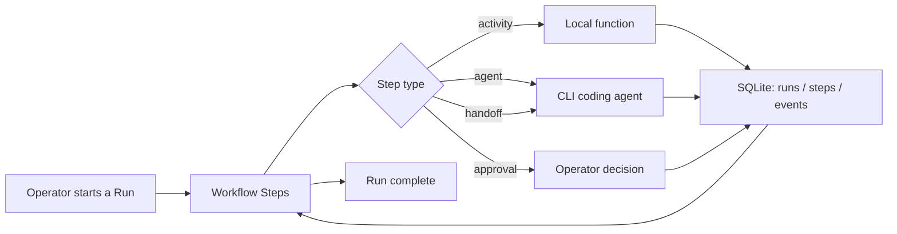

# 🤖 JARVIS-AWF

## 📋 Description

JARVIS-AWF is a personal, local-first workspace for running AI coding/research agents in a controlled, repeatable way. It's built and used by one operator, on their own machines. There is no product, no service, and no team behind it — just a spec and, as it gets built, some code to match it.

## 🏗️ Architecture

State lives in a single SQLite database plus plain files on disk — no required servers, containers, or external infrastructure. Work is organized as versioned Workflows made of Steps. A Step can call a local function, invoke a CLI coding agent (e.g. Claude Code, Codex CLI), wait for the operator's approval, or hand off to another agent. Every Step's outcome is written to SQLite before the next one starts, so a run can be killed and resumed without losing track of what already happened. Isolation is handled with a Git worktree per run plus each CLI agent's own permission settings, not a container platform.

The full design, including what's deliberately left out and why, is in [`docs/AGENTIC_WORKFLOW_FABRIC_SPEC.md`](docs/AGENTIC_WORKFLOW_FABRIC_SPEC.md).

## 🗺️ Flow

## 🤝 Contributions

This is a solo, personal project and isn't set up to take contributions right now — no CI, no contribution guide, no roadmap promises. Issues and comments are welcome if you find something useful or broken, but please don't expect a quick response or a merged PR.

## 📄 License

Apache License 2.0. See the license text at https://www.apache.org/licenses/LICENSE-2.0.
