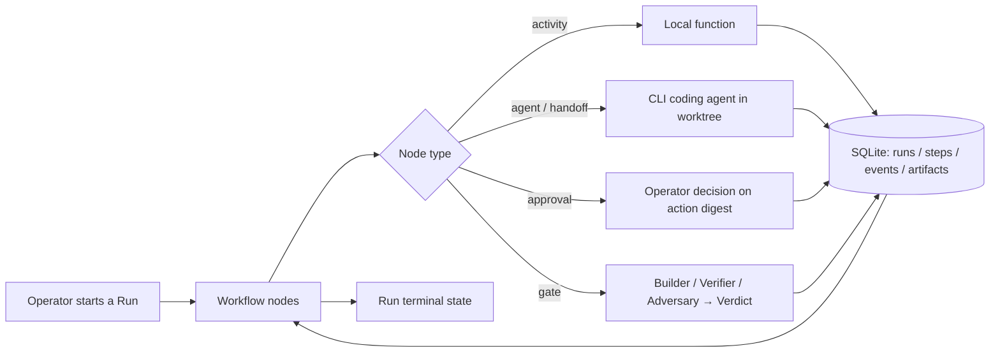

# 🤖 JARVIS-AWF

## 📋 Description

JARVIS-AWF is the reference implementation of the Agentic Workflow Fabric (AWF): a durable, local-first control system for running explicit, versioned Workflow definitions. Workflows can call local activities or drive AI coding and research agents. It is built and used by one operator, on their own machines.

The unit of operation is a Run of a versioned Workflow. Agents are bounded executors inside a Run; AWF is the durable layer above them — it invokes them, records what they did, verifies the result, and keeps the audit trail.

## 🚀 Quick Start

Setup is per-platform. Follow the guide for your host:

- [`docs/QuickStart-linux.md`](docs/QuickStart-linux.md) — Linux and WSL2
- [`docs/QuickStart-windows.md`](docs/QuickStart-windows.md) — Windows x64 and ARM64

Both cover the same sequence: create the backend virtual environment, install the hardware-appropriate dependency set, bootstrap local state, acquire the speech models, and validate.

For the repo-local operator path, the bootstrap wrappers perform that sequence and finish with a doctor report:

```bash
bash scripts/bootstrap.sh      # Linux / WSL2
.\scripts\bootstrap.ps1        # Windows PowerShell
```

After setup, the local first-run check is:

```bash
awf run assistant-default@1.0.0 --objective "check the system"
awf doctor
```

That workflow confirms request handling and durable Run creation without requiring an external coding-agent CLI.

## 🏗️ Architecture

Everything durable lives in one SQLite database plus content-addressed files under `data/`, which can be copied to another machine as a unit. Processes are operator-started and may exit at any time; a resume command picks up from the last completed step.

- **Workflows and Steps.** A Workflow is a graph of typed nodes. Every non-deterministic operation runs as a Step whose input and output are written down before the workflow moves on, so a crash resumes rather than restarts.
- **Registry.** Workflows, Agents, Capabilities, MCP servers, Model Profiles, Voice Profiles, and Skills are versioned files. Repository defaults ship with the project; operator additions live alongside them and take precedence.
- **Authorization.** A Capability Guard resolves every requested action against its declared risk class and the calling agent's allowlist, returning allow, deny, or approval-required — and recording the decision before the action runs.
- **Agent execution.** Named CLI coding agents are driven through one adapter contract, so adding another agent doesn't change the system around it.
- **Isolation.** Each mutating Run gets its own Git worktree and a disposable scratch directory, on top of whatever sandbox the agent tool provides.
- **Verification.** Gates are tiered. The default runs a builder and an independent verifier; high-risk work adds an adversary. No role assesses its own output, and the final verdict is written by control code, not by an agent.
- **Model access.** Routing, limits, and privacy class are declared per Model Profile. API keys resolve by name from an encrypted store whose key stays machine-local.
- **Observability.** Every state change, authorization decision, approval, and verdict is appended to one event log, queryable with plain SQL.

The full normative design is in [`docs/AGENTIC_WORKFLOW_FABRIC_SPEC.md`](docs/AGENTIC_WORKFLOW_FABRIC_SPEC.md).

## 🗺️ Flow



Every path through a node passes the Capability Guard, and every transition is recorded before the next node begins.

## 🖥️ Interfaces

One core with three surfaces. A headless command-line tool is the scriptable base and the only component that directly opens the durable database. **AWF-CLI** is a terminal UI where plain text starts the default assistant workflow and `/slash` commands expose operator actions. **AWF-GUI** is the desktop control center for chat, runs, approvals, readiness, registry actions, memory, and push-to-talk voice.

Run, status, resume, approvals, artifacts, readiness, and doctor commands now lead with operator-readable outcome text and keep raw payloads available with `--json`.

Both frontends are presentation layers over the same core protocol. High-risk approvals always require on-screen confirmation of the exact action.

## 🧰 Platform

Python for the core, Node for the frontends. Supported targets are Linux (including WSL2), Windows x64, and Windows ARM64, with CPU as the guaranteed floor on every host.

Acceleration is resolved by a hardware probe at setup — hardware facts and installed runtime capability are checked separately, then recorded as evidence rather than assumed. Speech models are operator-downloaded into a gitignored tree at setup.

## 🚦 Status

Working. The mandatory build sequence — bootstrap through the voice GUI — is complete, each phase gated on its own tests. The suite passes, the voice round trip runs end to end on accelerated and CPU-only hosts alike, and the repository tree matches the layout it documents.

Outstanding: one of the five named CLI adapters, the optional container isolation tier, and a small number of documented deviations recorded under `docs/adr/`.

## 🤝 Contributions

This is a solo, personal project and isn't set up to take contributions right now — no CI, no contribution guide, no roadmap promises. Issues and comments are welcome if you find something useful or broken, but please don't expect a quick response or a merged PR.

## 📄 License

Apache License 2.0. See the license text at https://www.apache.org/licenses/LICENSE-2.0.
Voice components and llm model usage remain under their own upstream licenses.
Coding agents driven by an adapter remain under their own upstream licenses.
