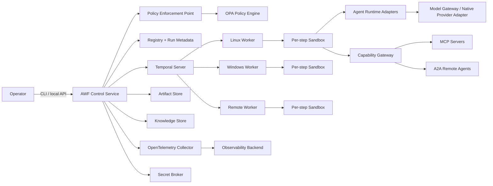
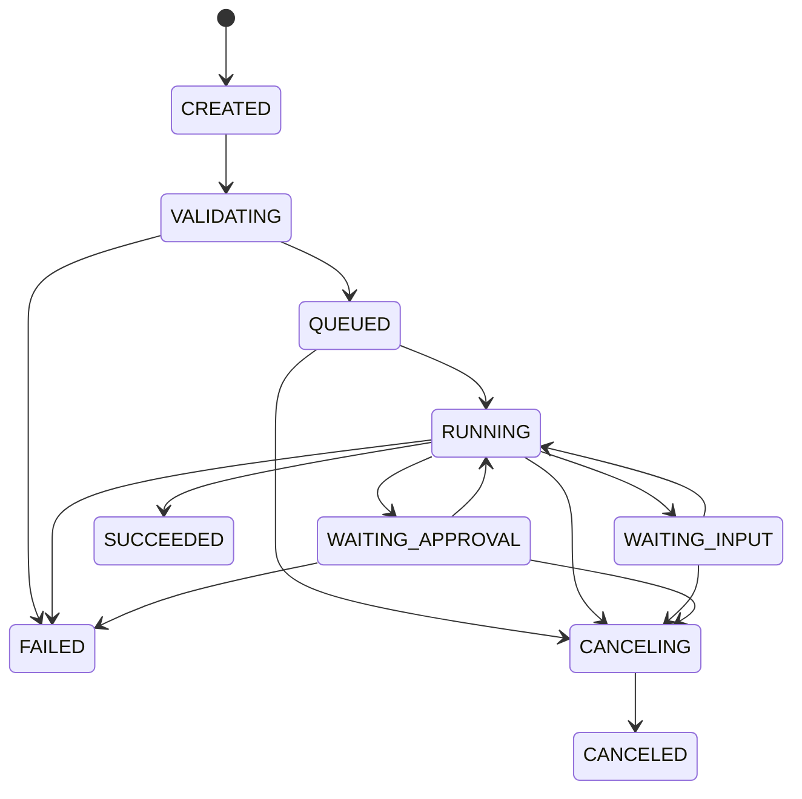

# Single-Operator Agentic Workflow Fabric
## Normative Architecture and Operating Specification

**Document status:** Normative design specification  
**Intended reader:** Software-building agents and human implementers  
**Scope:** Greenfield, single-operator system for durable AI-assisted work across coding, research, analysis, administration, and technical operations  

---

## 1. Normative language

The terms **MUST**, **MUST NOT**, **REQUIRED**, **SHOULD**, **SHOULD NOT**, and **MAY** are used as defined by RFC 2119 and RFC 8174.

A conforming implementation MUST satisfy every statement marked MUST or MUST NOT. A deviation requires a written Architecture Decision Record (ADR) that identifies the affected requirement, rationale, compensating control, and migration path.

This document deliberately distinguishes:

- **architecture requirements**, which remain stable across implementations;
- **reference implementation choices**, which remove ambiguity for the first implementation;
- **extension points**, which MAY be implemented later without changing the core contracts.

This is not a scaffold, starter repository, project plan, or phased implementation guide. Directory trees and generated boilerplate are intentionally omitted.

---

## 2. System definition

The system defined here is called the **Agentic Workflow Fabric**, abbreviated **AWF**.

AWF is a durable control plane that executes explicit workflows containing deterministic code, bounded AI-agent reasoning, tool calls, human approvals, independent evaluation, and immutable evidence artifacts.

AWF is **not**:

- a conversational personal assistant;
- a home-automation, voice, spatial-presence, or sensor-fusion system;
- a single autonomous “super-agent”;
- an agent-chat room in which models freely negotiate the work;
- a replacement for Git, CI, an operating system, a secrets manager, or a workflow engine;
- dependent on a specific model vendor, CLI agent, operating system, GPU, or local-model host;
- an automatic agent/tool generator;
- an existing JARVIS codebase upgrade.

The primary unit of operation is a **Run** of a versioned **Workflow Definition**. Agents are bounded executors inside that workflow; they are not the durable orchestrator.

---

## 3. Architectural conclusion derived from the reference breadcrumbs

The reusable design hidden in the reference documents is not the named hardware, services, or feature phases. The reusable design is the operating discipline surrounding them:

1. inspect reality before acting;
2. express work as explicit, versioned specifications;
3. separate production from verification and adversarial review;
4. preserve reports, test results, and verdicts on disk;
5. use measurable acceptance gates;
6. maintain cumulative regression coverage;
7. bound retries and escalate after non-convergence;
8. integrate capabilities through shared contracts rather than one-off prompt conventions;
9. treat security, recovery, and evaluation as recurring workflows;
10. prevent the producing agent from declaring its own work accepted.

AWF retains those invariants and replaces reference-specific assumptions as follows:

| Reference clue | AWF interpretation |
|---|---|
| Sequential phase prompts | Versioned durable workflow definitions |
| `wh test` targets | Uniform evaluation-suite and gate contracts |
| Builder / verifier / adversary | Independent producer, verifier, and adversary executions |
| Trifecta reports | Structured immutable evidence and findings artifacts |
| Watcher event backbone | Run event stream and OpenTelemetry trace model |
| MemPalace | Explicit working state, knowledge, and evidence stores |
| LiteLLM hook | Provider-neutral model gateway and policy router |
| Fleet agents and manifests | Versioned agent manifests and runtime adapters |
| MCP scaffold generator | Registered MCP capabilities; capability generation is outside the core |
| Hardware verification | Worker capability discovery and scheduling constraints |
| Self-healing agents | Durable retries and operational workflows, not self-modifying agents |
| Deep-research plan/workers/synthesis | A general plan–fan-out–synthesize workflow pattern |
| Monthly CVE loop | A general scheduled maintenance-workflow pattern |

The resulting system is therefore a **durable agent-work orchestration platform**, not a reconstruction of the original environment.

---

## 4. Research-backed design rules

Current guidance from OpenAI, Anthropic, Microsoft, Google, AWS, Temporal, MCP, A2A, OpenTelemetry, OPA, OWASP, and community standards converges on the following rules. AWF treats these as architectural requirements.

### 4.1 Deterministic outer control, bounded inner autonomy

The high-level execution path MUST be defined by code or a validated workflow graph. An LLM MAY reason within an agent step, select from an authorized capability subset, and produce structured decisions, but it MUST NOT own persistence, retries, authorization, acceptance, or global scheduling.

This follows the workflow-versus-agent distinction used by Anthropic and Microsoft: known process structure belongs in workflows; model reasoning belongs only where ambiguity requires it. OpenAI similarly distinguishes code-controlled orchestration from LLM-controlled delegation.

### 4.2 Durable execution is a separate layer

Workflow state MUST survive process restarts, machine restarts, transient provider failures, and operator absence. Every non-deterministic operation—including model calls, tool calls, subprocess execution, database reads outside workflow history, and remote-agent calls—MUST execute as a durable activity, not inside replayed workflow logic.

The reference implementation MUST use Temporal OSS for this layer.

### 4.3 Least capability, not maximum capability

An agent MUST receive only the tools, skills, repository roots, credentials, network destinations, and context required for its current step. Tool definitions MUST be loaded progressively rather than placing an entire capability catalog in every prompt.

### 4.4 Policy enforcement outside the model

Authorization, data classification, approval requirements, budget enforcement, sandbox limits, and prohibited actions MUST be enforced by deterministic code outside model prompts. A model statement such as “this is safe” has no authorization value.

### 4.5 Independent verification

A producer MUST NOT issue its own acceptance verdict. Verification and adversarial evaluation MUST run under separate execution identities and in separate contexts. Acceptance MUST be computed by the control plane from structured evidence.

### 4.6 Artifacts over conversational memory

Long-running work MUST hand off through explicit artifacts, repository state, run state, and evidence records. Conversation history MAY support a single agent invocation, but MUST NOT be the sole record of what was attempted, changed, tested, or decided.

### 4.7 Open community contracts where mature standards exist

AWF MUST use:

- **Agent Skills** for portable procedural skills;
- **MCP** for tool, resource, and prompt-provider interoperability;
- **A2A** for independently deployed remote agents;
- **AGENTS.md** for repository-scoped coding-agent instructions;
- **OpenTelemetry** for traces, metrics, and structured events;
- **JSON Schema 2020-12** for AWF data contracts;
- **Semantic Versioning** plus immutable content digests for published capabilities.

AWF MUST NOT invent proprietary replacements for those roles.

### 4.8 No automatic self-expansion

An agent MUST NOT dynamically create and activate a new agent, skill, tool, MCP server, workflow, policy, or evaluator during the same run. It MAY propose source changes or package candidates, but activation requires a separate reviewed change and registry publication.

---

## 5. System context



### 5.1 Trust boundary

The trusted control boundary contains:

- AWF Control Service;
- Temporal server and workflow code;
- PostgreSQL metadata stores;
- OPA policy engine and signed policy bundles;
- secret broker;
- artifact metadata and integrity verifier;
- registry validation and signature verification.

The following are untrusted or conditionally trusted inputs:

- model outputs;
- agent-generated plans;
- tool descriptions received from MCP servers;
- external documents, web pages, emails, issues, and repositories;
- A2A Agent Cards, messages, statuses, and artifacts;
- community skills and packages;
- subprocess stdout/stderr;
- validator prose that is not represented in its structured verdict.

The control plane MUST treat every item in the second list as data, never as policy.

---

## 6. Reference implementation profile

The first conforming implementation MUST use the following products and language choices unless superseded by an ADR.

| Function | Required reference implementation |
|---|---|
| Control service and workers | Python `>=3.12,<3.15`, FastAPI, Pydantic v2 |
| Durable orchestration | Temporal OSS and Temporal Python SDK |
| Metadata and registry | PostgreSQL with separate logical databases for AWF and Temporal |
| Vector retrieval | `pgvector` in the AWF PostgreSQL database; disabled until a knowledge collection requires embeddings |
| Policy engine | OPA in local sidecar/service mode using Rego bundles |
| Secret broker | OpenBao; agents receive secret references or scoped proxy credentials, not vault access |
| Container isolation on Linux | Rootless Podman using OCI images |
| Container isolation on Windows | General workloads use WSL2-hosted rootless Podman. Windows-native workloads use an ephemeral Hyper-V VM or Windows Sandbox backend; direct host execution is prohibited. |
| Source isolation | Git worktrees created per run or per mutating step |
| Model gateway | LiteLLM Proxy for normalized API-based model access; native provider adapters for features not representable through the normalized API |
| API-native agent loop | OpenAI Agents SDK behind the AWF agent-runtime adapter; additional frameworks MAY be added as adapters |
| Telemetry | OpenTelemetry SDK + Collector; local Grafana LGTM backend is the default operator view |
| Artifact storage | Content-addressed local filesystem store; S3-compatible storage MAY replace it without changing artifact URIs |
| Serialization | UTF-8 JSON or YAML validated against JSON Schema 2020-12 |
| Conditional expressions | Common Expression Language (CEL), evaluated by the control service |
| Identifiers | UUIDv7 |
| Time | UTC RFC 3339 timestamps with nanosecond precision where available |
| Package integrity | SHA-256 digests; Sigstore/Cosign signatures for externally sourced packages |

### 6.1 Operating-system placement

The control plane MUST run on a Linux kernel because Temporal, rootless OCI isolation, local policy sidecars, and CLI-agent containment are most predictable there. Acceptable placements are:

1. native Linux;
2. a dedicated Linux virtual machine;
3. WSL2 on Windows.

Windows-specific work MUST execute on a registered Windows worker using an ephemeral Hyper-V VM or Windows Sandbox backend. If neither backend is available, the step is unschedulable; AWF MUST NOT fall back to direct host execution. General workflows MUST NOT assume a shell, path syntax, package manager, GPU, or processor architecture. Worker requirements are declared as capabilities and resolved by the scheduler. Worktrees used by a WSL2 worker MUST reside in the Linux filesystem, not a mounted Windows filesystem, unless an explicit compatibility test for that repository passes.

### 6.2 Hardware independence

AWF MUST run without a GPU and without a local model. Local model endpoints are optional model-provider registrations. GPU memory, architecture, and installed accelerators are worker capability facts, never global architectural assumptions.

---

## 7. Logical components

### 7.1 AWF Control Service

The Control Service is the single authoritative API and policy-enforcement entry point. It MUST:

- authenticate the operator and workers;
- validate and publish registry objects;
- create Runs with immutable definition digests;
- enforce idempotency on mutating API calls;
- start, signal, query, and cancel Temporal workflows;
- expose approval requests and bind decisions to exact action digests;
- provide read access to events and artifacts;
- enforce artifact and registry retention policies;
- never execute model calls or arbitrary tools in its own process.

The Control Service MUST be a modular monolith for the single-operator deployment. It MUST NOT be decomposed into independent microservices unless scale measurements justify that change.

### 7.2 Temporal workflow layer

The Temporal workflow layer is the durable state machine. Workflow code MUST:

- contain only deterministic logic;
- schedule every side effect as an Activity;
- store only compact serializable state;
- use Signals or Updates for approvals and operator input;
- use `continue-as-new` before workflow history reaches configured limits;
- propagate cancellation to child workflows and activities;
- never call an LLM, MCP server, subprocess, filesystem, or arbitrary database directly.

### 7.3 AWF Worker

An AWF Worker executes registered Activities. Each worker MUST publish a signed capability record containing:

- worker ID and software version;
- operating system and version;
- CPU architecture;
- available OCI runtime;
- installed agent-runtime adapter IDs and versions;
- installed deterministic activity IDs and versions;
- available shells and toolchains;
- optional GPU type and memory;
- network-zone labels;
- local model endpoint labels;
- maximum concurrent sandboxes;
- health and free resource measurements.

The scheduler MUST select a worker whose capabilities satisfy every requirement of the step. It MUST fail scheduling rather than silently substituting an incompatible environment.

### 7.4 Sandbox Manager

The Sandbox Manager creates an isolated environment for every agent step and every untrusted command activity.

A sandbox MUST have:

- a unique sandbox ID;
- a dedicated unprivileged UID/GID inside the container;
- a read-only base image pinned by digest;
- an ephemeral writable layer;
- an explicitly mounted workspace root;
- explicit CPU, memory, process, disk, and wall-clock limits;
- no host Docker/Podman socket;
- no privileged mode;
- no host home-directory mount;
- no ambient host credentials;
- a default-deny network policy;
- a deterministic teardown and artifact-extraction process.

A mutating repository step MUST receive a dedicated Git worktree. Two mutating steps MUST NOT share a worktree concurrently.

### 7.5 Agent Runtime Adapter

An Agent Runtime Adapter translates an AWF Agent Invocation into a specific agent implementation. The required adapter types are:

- `cli`: invokes a registered CLI coding/research agent as a subprocess;
- `sdk`: invokes an API-native agent loop in-process inside the worker sandbox;
- `a2a`: invokes an independently deployed A2A agent through the Capability Gateway.

The adapter MUST NOT decide authorization, model policy, workflow transitions, or acceptance. It MUST return a normalized `AgentResult`.

### 7.6 Capability Gateway

The Capability Gateway is the only route from an agent to external, remote, credentialed, or privileged tools, resources, prompts, or agents. Sandbox-local file and shell primitives may be supplied by a conforming harness adapter, but they remain confined by the Sandbox Profile and MUST be traced. The Capability Gateway MUST:

- present only capabilities authorized for the current run and step;
- classify every invocation using local registry metadata;
- query OPA before execution;
- request approval when required;
- inject credentials outside model-visible payloads;
- enforce timeouts, payload limits, and result truncation;
- create an immutable invocation record;
- scan outputs for secrets and policy violations;
- expose MCP clients and A2A clients through separate adapters.

An agent MUST NOT connect directly to an arbitrary MCP or A2A endpoint. A CLI adapter that cannot intercept its agent's built-in network tools MUST run with sandbox network egress disabled and is ineligible for workflows requiring external or credentialed actions.

### 7.7 Model Gateway

The Model Gateway provides normalized access to API-hosted and local models. It MUST:

- enforce model-profile policies;
- issue per-run scoped virtual keys where supported;
- record provider, requested model, resolved model, token usage, latency, and cost;
- apply configured retries and fallbacks;
- prohibit a fallback that violates the run’s privacy or data-residency classification;
- redact or disable content logging by default;
- support direct native adapters when a required provider feature cannot be represented by LiteLLM.

CLI-agent runtimes that use their own provider protocol MUST still be registered with a model profile and budget. Where they cannot use the Model Gateway, they MUST receive a dedicated scoped provider credential and MUST report usage when the CLI exposes it.

### 7.8 Registry

The Registry stores immutable, versioned definitions for:

- workflows;
- agents;
- activities;
- skills;
- MCP servers and locally classified MCP capabilities;
- A2A agents;
- model profiles;
- sandbox profiles;
- policy sets;
- evaluation suites;
- schemas.

A registry publication MUST include a semantic version, SHA-256 digest, source provenance, compatibility metadata, and trust status. Published versions MUST be immutable. Updating content requires a new version.

Trust statuses are:

- `local`: authored and reviewed locally;
- `trusted`: externally sourced and explicitly approved;
- `quarantined`: installed for evaluation but unavailable to normal workflows;
- `blocked`: prohibited from loading or execution.

### 7.9 Artifact Store

The Artifact Store holds immutable run outputs and evidence. Artifact bytes MUST be addressed by SHA-256. Metadata MUST be stored transactionally in PostgreSQL before the artifact is exposed as complete.

A mutable human-friendly alias MAY point to an artifact, but aliases MUST NOT change the content identified by an artifact URI.

### 7.10 Knowledge and Context Service

The Knowledge and Context Service stores operator-approved durable knowledge and retrieves bounded context for agent invocations. It MUST maintain provenance and temporal validity.

It MUST NOT automatically convert all conversations, traces, or tool outputs into long-term memory.

### 7.11 Evaluation Service

The Evaluation Service executes deterministic assertions, environment checks, trajectory checks, verifier agents, adversarial agents, and optional human review. It MUST write structured findings and verdicts, not only prose.

### 7.12 Observability pipeline

All services and workers MUST emit OpenTelemetry traces, metrics, logs, and named state-change events. Prompt and response bodies MUST be excluded by default; their artifact IDs, hashes, token counts, and redacted summaries MAY be recorded.

---

## 8. Canonical concepts and boundaries

### 8.1 Workflow

A **Workflow** defines durable control flow. It answers: which steps exist, when they may run, what they consume and produce, where humans intervene, and what constitutes acceptance.

A workflow is deterministic except inside declared agent and evaluator steps.

### 8.2 Agent

An **Agent** is a bounded reasoning executor consisting of:

- instructions;
- a model policy or external agent runtime;
- an allowed skill set;
- an allowed capability set;
- structured input and output schemas;
- budgets;
- a sandbox profile;
- termination rules.

An agent is not a daemon by definition. Persistent services MAY host agents, but each invocation is run-scoped and independently auditable.

### 8.3 Tool

A **Tool** is an operation exposed to a model or deterministic activity. Tool selection may be model-driven, but tool execution is deterministic software. An MCP tool is a tool transported through MCP; MCP does not make it an agent.

### 8.4 Resource

A **Resource** is context or data exposed through a stable URI. It is read by the host and selected for model context according to policy. It is not an executable tool.

### 8.5 Prompt

An MCP **Prompt** is a reusable user-invoked prompt template. AWF MUST NOT treat an MCP prompt as an automatically trusted system instruction.

### 8.6 Skill

A **Skill** is a portable procedural instruction package conforming to the Agent Skills specification. A skill teaches an agent how to perform a class of task. It does not grant permissions. Every tool referenced by a skill must still be authorized independently.

### 8.7 Activity

An **Activity** is a registered deterministic or side-effecting worker operation scheduled by Temporal. Examples include creating a worktree, invoking a model, calling a tool, running tests, calculating a digest, and publishing an artifact.

### 8.8 Evaluator

An **Evaluator** assesses an output against an Eval Suite. It may be deterministic, model-based, adversarial, or human. It never modifies the candidate output.

### 8.9 Policy

A **Policy** is deterministic authorization or governance logic evaluated outside the model. Instructions and prompt text are not policies.

### 8.10 Harness

The **Agent Harness** is the runtime around one agent invocation: context assembly, model loop, tool mediation, budget accounting, checkpoint artifacts, termination detection, and normalized result generation. The harness is not the durable workflow engine.

---

## 9. Portable community-facing formats

### 9.1 Repository instructions: AGENTS.md

Every source repository operated on by coding agents SHOULD contain an `AGENTS.md` file. It MUST contain only repository-scoped, always-applicable information such as:

- authoritative build and test commands;
- formatting and style rules;
- architectural boundaries;
- security restrictions;
- generated-file rules;
- pull-request or change-validation expectations.

Task-specific procedures MUST NOT be placed in `AGENTS.md`; they belong in skills or workflows. Nested `AGENTS.md` files MAY refine rules, with the nearest file taking precedence according to the open AGENTS.md convention.

### 9.2 Skills: Agent Skills specification

A shareable AWF skill MUST be a directory containing a valid `SKILL.md` with Agent Skills frontmatter. It MAY include `scripts/`, `references/`, and `assets/`.

AWF imposes these additional requirements:

- `metadata.version` MUST contain a semantic version;
- `metadata.publisher` MUST identify the publisher;
- `metadata.digest` MUST be added at registry publication time;
- `compatibility` MUST name required OS, commands, runtimes, or network access;
- `allowed-tools` MAY document expected tools but MUST NOT grant authorization;
- `SKILL.md` SHOULD remain under 500 lines;
- references SHOULD be one level deep;
- executable scripts MUST be checksummed, scanned, and sandboxed;
- a community skill enters the registry as `quarantined`.

### 9.3 Tools and resources: MCP

AWF MUST implement MCP version `2025-11-25` as its stable interoperability baseline until a later stable specification is adopted by ADR.

Transport rules:

- local MCP servers MUST use `stdio` unless a technical requirement prevents it;
- remote MCP servers MUST use Streamable HTTP over HTTPS;
- local HTTP servers MUST bind to loopback only;
- Streamable HTTP servers MUST validate `Origin`;
- HTTP authorization MUST follow the MCP OAuth requirements, including protected-resource metadata and audience-bound resource indicators;
- an MCP client connection MUST be owned by the AWF host, with one logical client per server connection.

MCP primitive mapping:

| MCP primitive | AWF treatment |
|---|---|
| Tool | Callable capability subject to local classification, policy, approval, and audit |
| Resource | Context/data addressable by URI; never executable |
| Prompt | User-selectable template; never privileged system policy |
| Sampling | Disabled by default; enabling requires explicit policy and per-request control |
| Roots | Limited to sandbox-mounted roots; never the host filesystem |
| Elicitation | Routed to an AWF input request; never answered silently by the model |

Tool descriptions and annotations received from a server MUST be treated as untrusted. AWF’s local capability record is authoritative for risk, permissions, and approval requirements.

A publicly shared MCP server SHOULD provide official MCP Registry `server.json` metadata, a reverse-DNS namespace, semantic version, package provenance, license, and checksum/signature. The public registry’s preview status means AWF MUST cache approved metadata locally and MUST NOT auto-enable a newly published version.

### 9.4 Remote agents: A2A

AWF MUST use A2A 1.0 only when the target is an independently deployed, potentially opaque agent service. Internal AWF nodes, tools, and activities MUST NOT be wrapped in A2A merely for uniformity.

A2A mapping:

- an A2A Agent Card is discovery metadata, not proof of trust;
- an A2A Task maps to an external child-execution record;
- A2A Messages carry interaction and clarification;
- A2A Artifacts carry task outputs;
- critical output MUST be retrieved as artifacts or final task state, not assumed delivered by transient status messages;
- all Agent Card fields, messages, parts, artifacts, and status text are untrusted input;
- authenticated or signed Agent Cards MAY improve provenance but do not replace local authorization.

AWF MUST publish an A2A Agent Card only for workflows or agents intentionally exposed as remote services. Internal implementation details, model prompts, tool inventories not needed for discovery, and credentials MUST NOT appear in the card.

### 9.5 Workflow, agent, policy, and eval packages

No broadly accepted community standard currently covers AWF’s durable workflow, governance, evidence, and acceptance semantics. AWF therefore defines the formats in this specification. Packages MAY be distributed through Git or as OCI artifacts, but their internal manifests MUST conform to AWF schemas and retain semantic version plus SHA-256 digest.

---

## 10. Registry object envelope

Every AWF registry object MUST use this envelope:

```yaml
apiVersion: awf.dev/v1
kind: <Workflow|Agent|Activity|ModelProfile|SandboxProfile|PolicySet|EvalSuite|Schema>
metadata:
  name: <dns-label-compatible-name>
  version: <semantic-version>
  description: <non-empty string>
  publisher: <publisher-id>
  source:
    uri: <source-uri>
    revision: <git-commit-or-package-version>
  labels: {}
  annotations: {}
spec: {}
```

Normative rules:

- `metadata.name` MUST be lowercase DNS-label compatible and no longer than 63 characters.
- `metadata.version` MUST be a valid semantic version.
- `metadata.name + metadata.version + kind` MUST be unique.
- The registry MUST canonicalize the object as JSON and compute a SHA-256 digest.
- `apiVersion`, `kind`, `metadata.name`, `metadata.version`, and `spec` MUST be included in the digest.
- Server-assigned publication metadata MUST be stored outside the digested document.
- Unknown fields MUST cause validation failure unless the schema explicitly permits them.

---

## 11. Workflow Definition contract

### 11.1 Required shape

A Workflow Definition `spec` MUST contain:

```yaml
spec:
  inputSchema: <schema-ref>
  outputSchema: <schema-ref>
  policySet: <policy-set-ref>
  defaultSandbox: <sandbox-profile-ref>
  budgets: <budget-object>
  nodes: {}
  outputs: {}
  evaluation: <eval-policy-object>
```

A workflow is a directed acyclic graph plus bounded `map` and `loop` nodes. Arbitrary graph cycles are prohibited.

### 11.2 Node types

Exactly these node types are defined in `awf.dev/v1`:

| Type | Purpose |
|---|---|
| `activity` | Run a registered deterministic/side-effecting Activity |
| `agent` | Invoke a registered Agent through an adapter |
| `approval` | Wait for an operator decision bound to a proposed action |
| `gate` | Evaluate candidate artifacts through an Eval Suite |
| `subworkflow` | Start a version-pinned child Workflow |
| `map` | Run a child Workflow over a bounded input array |
| `loop` | Repeat a child Workflow while a CEL condition is true, subject to a hard maximum |

No implementation may introduce an implicit node type. New types require a new API version or backward-compatible schema extension approved by ADR.

### 11.3 Common node fields

Every node MUST define:

```yaml
<node-id>:
  type: <node-type>
  dependsOn: []
  when: <optional-cel-expression>
  input: {}
  timeout: <duration>
  retryPolicy: <retry-policy-ref-or-inline>
  workerSelector: {}
  sandbox: <optional-sandbox-profile-ref>
```

Rules:

- Node IDs MUST match `^[a-z][a-z0-9-]{0,62}$`.
- `dependsOn` MUST reference existing nodes.
- A node becomes READY only after all dependencies reach terminal success or skip states.
- `when` is evaluated after dependencies complete. False means `SKIPPED`.
- A `when` expression MAY read workflow inputs and dependency outputs only.
- A node MUST NOT read another node’s uncommitted filesystem state; data crosses nodes through artifacts or declared structured outputs.
- `timeout` is mandatory and must be finite.

### 11.4 Activity node

An activity node MUST include `activityRef` pinned to version and digest. Its input MUST validate against the Activity input schema. Activity output MUST validate before the node succeeds.

### 11.5 Agent node

An agent node MUST include:

```yaml
agentRef: <agent-name>@<version>#sha256:<digest>
completionContract:
  outputSchema: <schema-ref>
  requiredArtifacts: []
  completionMarker: <optional-string>
```

The completion contract is authoritative. Natural-language claims of completion are insufficient.

### 11.6 Approval node

An approval node MUST specify:

- approval reason;
- action class;
- exact proposed-action artifact or canonical JSON payload;
- expiration duration;
- allowed decisions (`approve`, `reject`, and optionally `edit`);
- downstream node to which the approval applies.

An approval decision MUST bind to the SHA-256 digest of the proposed action. Any material input change invalidates the approval.

### 11.7 Gate node

A gate node MUST specify:

- `evalSuiteRef` pinned by version and digest;
- candidate artifact references;
- required grader classes;
- threshold policy;
- maximum repair loops;
- repair node or subworkflow, if repair is allowed.

The control plane computes the gate result. A grader’s prose cannot override its structured result.

### 11.8 Subworkflow node

A subworkflow MUST be version and digest pinned. Parent cancellation MUST propagate to the child unless the node explicitly declares a detached operational workflow, which requires an elevated policy decision.

### 11.9 Map node

A map node MUST specify:

- an input array expression;
- `maxItems`;
- `maxConcurrency`;
- a child workflow reference;
- aggregate output behavior (`all`, `successful`, or `fail-fast`).

The array length MUST be validated before child runs start. Model-generated unbounded fan-out is prohibited.

### 11.10 Loop node

A loop node MUST specify:

- a child workflow reference;
- a CEL continuation condition;
- `maxIterations` between 1 and the policy-set maximum;
- state values passed from one iteration to the next;
- convergence evidence.

A loop MUST stop on success, false condition, maximum iterations, budget exhaustion, cancellation, or non-retryable failure.

### 11.11 Workflow outputs

Workflow outputs MUST be computed from successful node structured outputs or artifact references. A workflow MUST fail if required outputs cannot be produced or do not validate against `outputSchema`.

### 11.12 Normative serialization example

The following is a contract example, not a project scaffold:

```yaml
apiVersion: awf.dev/v1
kind: Workflow
metadata:
  name: produce-verify-repair
  version: 1.0.0
  description: Produce a candidate, verify it independently, and repair bounded findings.
  publisher: local
  source:
    uri: git+file:///definitions
    revision: 0123456789abcdef
spec:
  inputSchema: schema://work-request@1.0.0
  outputSchema: schema://accepted-deliverable@1.0.0
  policySet: default@1.0.0
  defaultSandbox: standard-workspace@1.0.0
  budgets:
    wallClock: PT2H
    modelInputTokens: 1000000
    modelOutputTokens: 200000
    toolCalls: 500
    costUsd: 30
  nodes:
    produce:
      type: agent
      dependsOn: []
      input:
        request: $.input
      timeout: PT45M
      retryPolicy: agent-safe@1.0.0
      workerSelector:
        capabilities: [git, python]
      agentRef: producer@1.0.0#sha256:...
      completionContract:
        outputSchema: schema://producer-result@1.0.0
        requiredArtifacts: [candidate, producer-report]
    gate:
      type: gate
      dependsOn: [produce]
      input:
        candidate: $.nodes.produce.artifacts.candidate
      timeout: PT45M
      retryPolicy: none@1.0.0
      workerSelector: {}
      evalSuiteRef: deliverable-gate@1.0.0#sha256:...
      requiredGraders: [deterministic, verifier, adversary]
      maxRepairLoops: 3
      repairWorkflowRef: repair-findings@1.0.0#sha256:...
  outputs:
    deliverable: $.nodes.gate.acceptedArtifact
  evaluation:
    closeRunOnlyOnGatePass: true
```

---

## 12. Agent Manifest contract

### 12.1 Required shape

An Agent `spec` MUST contain:

```yaml
spec:
  adapterRef: <adapter-ref>
  instructions: <artifact-or-package-ref>
  inputSchema: <schema-ref>
  outputSchema: <schema-ref>
  modelProfile: <model-profile-ref-or-null>
  skills: []
  capabilities: []
  sandbox: <sandbox-profile-ref>
  budgets: <budget-object>
  termination: <termination-object>
  delegation: <delegation-object>
  contextPolicy: <context-policy-object>
```

### 12.2 Adapter references

- A `cli` adapter reference identifies a locally registered executable adapter, not an arbitrary shell command.
- An `sdk` adapter reference identifies a packaged agent runtime and version.
- An `a2a` adapter reference identifies a locally approved A2A registration.

The manifest MUST NOT contain raw provider credentials or command-line secrets.

### 12.3 Instructions

Instructions MUST be versioned content. They MUST define:

- role and scope;
- objective;
- inputs and authoritative sources;
- allowed decisions;
- prohibited actions;
- artifact and output obligations;
- stop conditions;
- escalation conditions.

Instructions MUST NOT duplicate deterministic authorization policy. They MAY explain policy for usability, but the external policy remains authoritative.

### 12.4 Skills

Each skill reference MUST be pinned by semantic version and digest. The Context Service MUST load only the selected skill metadata at discovery time and the full skill body only when activated. Skill activation MUST be recorded as an event.

### 12.5 Capabilities

Each capability reference MUST identify one of:

- `activity`;
- `mcp-tool`;
- `mcp-resource`;
- `mcp-prompt`;
- `agent-tool` (bounded invocation of another registered AWF agent);
- `a2a-agent`.

A capability list is a maximum allowlist, not a grant. OPA may further restrict it per run and invocation.

### 12.6 Delegation

The delegation object MUST define:

- `allowed`: boolean;
- `targets`: explicit agent references;
- `maxDepth`: integer, default 1, system maximum 2;
- `maxConcurrentDelegates`: integer;
- `returnMode`: `structured-result` or `artifact`.

An agent MUST NOT delegate to an unregistered target or dynamically invent a new target.

### 12.7 Termination

Termination MUST define finite values for:

- maximum model turns;
- maximum tool calls;
- maximum consecutive tool errors;
- maximum no-progress turns;
- wall-clock timeout;
- required completion contract.

The harness MUST terminate an invocation when any hard limit is reached. It MUST return `LIMIT_EXCEEDED`, not manufacture a successful output.

### 12.8 Context policy

Context policy MUST define:

- allowed knowledge collections;
- maximum retrieved tokens;
- maximum conversation/history tokens;
- permitted data classifications;
- whether external untrusted content is allowed;
- whether summaries may replace prior turns;
- whether run artifacts may be re-read.

### 12.9 Normalized Agent Invocation

Every adapter receives this `AgentInvocation` structure:

```json
{
  "invocation_id": "uuidv7",
  "run_id": "uuidv7",
  "step_id": "string",
  "attempt": 1,
  "agent_ref": "producer@1.0.0#sha256:...",
  "objective": "string",
  "inputs": {},
  "workspace": {
    "root": "/workspace",
    "mode": "read-write",
    "baseline_revision": "git-commit-or-null"
  },
  "available_capabilities": [],
  "available_skills": [],
  "constraints": {},
  "completion_contract": {},
  "artifact_staging_uri": "awf-staging://...",
  "trace_context": {}
}
```

The adapter MUST return a normalized `AgentResult`:

```json
{
  "status": "COMPLETED|NEEDS_INPUT|BLOCKED|FAILED|LIMIT_EXCEEDED|CANCELED",
  "structured_output": {},
  "artifact_candidates": [],
  "findings": [],
  "usage": {},
  "termination_reason": "string",
  "adapter_metadata": {}
}
```

`COMPLETED` does not imply acceptance; it means only that the invocation satisfied its completion contract.

---

## 13. Activity contract

An Activity definition MUST declare:

- input and output schemas;
- implementation package and digest;
- supported worker selectors;
- side-effect class;
- idempotency behavior;
- retry safety;
- timeout requirements;
- required secret references;
- network destinations;
- artifact production behavior;
- compensation activity, if applicable.

Side-effect classes are:

| Class | Meaning |
|---|---|
| `pure` | No external state change; safe to repeat |
| `read` | Reads external state only |
| `reversible-write` | Mutates state and has a tested compensation path |
| `idempotent-write` | Mutates state but repeated calls with the same idempotency key have one effect |
| `irreversible-write` | Mutates state without reliable rollback |

An activity classified as `irreversible-write` MUST have an R2 approval requirement unless a stricter policy blocks it.

---

## 14. Capability registration and tool shape

### 14.1 Local authoritative capability record

Every callable capability MUST have a local record containing:

```yaml
identity:
  type: mcp-tool|activity|agent-tool|a2a-agent
  serverOrProvider: <id>
  name: <name>
  version: <version>
  digest: <digest>
schema:
  input: <json-schema-ref>
  output: <json-schema-ref>
effects:
  operation: read|create|update|delete|execute|communicate
  resources: []
  dataClasses: []
  externalSideEffect: true|false
  reversible: true|false
  idempotent: true|false
security:
  riskClass: R0|R1|R2|R3
  approval: never|per-run|per-invocation|prohibited
  requiredSecrets: []
  networkDestinations: []
limits:
  timeout: <duration>
  maxInputBytes: <integer>
  maxOutputBytes: <integer>
  rateLimit: <object>
```

Remote descriptions MAY populate a draft record, but activation requires local classification and approval.

### 14.2 Tool design rules

A tool MUST:

- have one clear purpose;
- have a unique namespaced name;
- use descriptive, non-overlapping parameters;
- validate inputs before side effects;
- return structured, high-signal results;
- distinguish user-correctable errors from system errors;
- avoid returning large unfiltered payloads;
- support pagination or artifact output for large results;
- include stable identifiers required for follow-up operations;
- avoid requiring the model to parse human-oriented console formatting.

A collection of low-level tools that leaves the agent to reconstruct a common transactional operation SHOULD be replaced by a higher-level task-oriented tool, while preserving narrowly scoped primitives for deterministic workflows where needed.

### 14.3 Progressive discovery

An agent MUST NOT receive all tool schemas by default. The Capability Gateway MUST support search/filter over locally approved capability metadata and reveal full schemas only for the selected subset. A workflow MAY prebind required tools to eliminate discovery ambiguity.

---

## 15. Model Profile and routing contract

### 15.1 Model Profile

A Model Profile identifies required behavior, not a marketing model name. It MUST declare:

- allowed providers and models in priority order;
- minimum context window;
- required modalities;
- required structured-output or tool-calling support;
- reasoning tier;
- maximum per-call and per-run cost;
- maximum latency target;
- data classification ceiling;
- whether prompts may leave the local network;
- fallback policy;
- content-retention requirements;
- region requirements, if any.

### 15.2 Routing

Routing MUST be performed by deterministic policy over the Model Profile, current provider health, budgets, and declared task metadata. An optional classifier MAY propose a task class, but it MUST produce structured output and MUST NOT override privacy, cost, or authorization policy.

### 15.3 Fallback rules

- A fallback MUST meet or exceed the data-protection requirements of the primary target.
- A `local-only` profile MUST never fall back to a cloud provider.
- A fallback to a weaker capability tier MUST be visible in the Run events and MAY require operator consent when it can affect result quality.
- Provider failure MUST NOT silently cause a different agent or workflow to execute.

### 15.4 Data flywheel

Telemetry MAY be used to improve routing or evaluations only after redaction and explicit operator enablement. Model prompts and outputs MUST NOT automatically become training data. Any derived dataset MUST record source Run IDs, consent state, redaction version, and label provenance.

---

## 16. Run and step state machines

### 16.1 Run states

A Run MUST use exactly these states:

```text
CREATED
VALIDATING
QUEUED
RUNNING
WAITING_INPUT
WAITING_APPROVAL
CANCELING
SUCCEEDED
FAILED
CANCELED
```

Allowed transitions:



A Run reaches `SUCCEEDED` only when all required outputs validate and all configured close gates pass.

### 16.2 Step states

A step MUST use exactly these states:

```text
PENDING
READY
RUNNING
WAITING_INPUT
WAITING_APPROVAL
RETRY_WAIT
SUCCEEDED
FAILED
SKIPPED
CANCELED
```

Every execution attempt MUST have its own immutable attempt record. A retry changes the step state but never overwrites an earlier attempt.

### 16.3 Events

Every state transition MUST emit a named event with:

- event ID;
- run ID;
- step ID where applicable;
- attempt number where applicable;
- prior and new state;
- timestamp;
- actor identity;
- reason code;
- trace and span IDs;
- related artifact IDs;
- policy decision ID when applicable.

Events are append-only. Corrections are new events, not edits.

---

## 17. Execution semantics

### 17.1 Validation before queueing

Before a Run is queued, AWF MUST validate:

- workflow schema and digest;
- all referenced registry objects and digests;
- no unresolved references;
- DAG acyclicity outside bounded loop nodes;
- input schema;
- policy-set existence;
- budget compatibility;
- worker capability satisfiability;
- trust status of every package;
- absence of blocked capabilities;
- output path feasibility.

Validation failure is terminal and MUST produce a validation report artifact.

### 17.2 Context isolation

Each agent invocation MUST begin with a fresh model context unless its manifest explicitly requests a run-scoped session. A verifier and adversary MUST never receive the producer’s hidden reasoning context. They MAY receive candidate artifacts, requirements, test evidence, and prior structured findings.

### 17.3 Workspace transfer

Repository state transfers through Git commits, patches, or content-addressed artifacts. An agent MUST commit or export its candidate changes before another execution evaluates them. A validator MUST mount the candidate read-only except for its own report and test-output area.

### 17.4 No hidden side channels

Agents MUST NOT communicate through shared temp directories, shared process memory, untracked host files, or reused home directories. Cross-step communication occurs only through declared outputs, artifacts, workflow state, or approved external systems.

### 17.5 Concurrency

- The Run budget defines maximum total concurrent nodes.
- A map node defines its own lower maximum.
- Mutating steps targeting the same logical resource MUST acquire a named lease.
- Leases MUST have fencing tokens to prevent stale workers from committing after timeout.
- Read-only steps MAY run concurrently unless a policy or external rate limit prohibits it.

### 17.6 Cancellation

Cancellation MUST propagate to active activities, subprocesses, sandboxes, and child workflows. The worker MUST send graceful termination, wait the configured grace period, then force termination. Partial artifacts MUST be marked incomplete and cannot satisfy a completion contract.

---

## 18. Retry, idempotency, and compensation

### 18.1 Failure classes

Every failed activity or adapter call MUST be classified as one of:

- `TRANSIENT`: network interruption, rate limit, temporary provider unavailability;
- `TIMEOUT`: activity exceeded a declared timeout;
- `INVALID_INPUT`: schema or precondition failure;
- `POLICY_DENIED`: deterministic authorization denial;
- `APPROVAL_REJECTED`: operator rejected the proposed action;
- `TOOL_ERROR`: tool executed and returned a domain error;
- `SANDBOX_VIOLATION`: resource, filesystem, network, or process policy violation;
- `NONDETERMINISTIC_OUTPUT`: malformed or schema-invalid model result after repair attempts;
- `INTEGRITY_FAILURE`: digest, signature, provenance, or artifact mismatch;
- `UNKNOWN_SIDE_EFFECT`: execution outcome cannot be determined safely;
- `INTERNAL`: AWF implementation failure.

### 18.2 Retry rules

- `TRANSIENT` MAY retry with exponential backoff and jitter.
- `TIMEOUT` MAY retry only if the Activity is pure, read-only, or idempotent.
- `INVALID_INPUT`, `POLICY_DENIED`, `APPROVAL_REJECTED`, `SANDBOX_VIOLATION`, and `INTEGRITY_FAILURE` MUST NOT retry automatically.
- `UNKNOWN_SIDE_EFFECT` MUST pause for operator review.
- An agent step MAY retry after a provider failure only if no non-idempotent tool action occurred in the attempt.
- Retry counts MUST be finite and declared.

### 18.3 Idempotency keys

Every mutating tool or activity invocation MUST receive an AWF invocation ID as an idempotency key. If the target does not support idempotency, the capability record MUST say so and the policy MUST elevate its risk class.

### 18.4 Compensation

A reversible write MUST declare a tested compensation Activity. Compensation is itself policy controlled, recorded, and may require approval. AWF MUST NOT claim rollback succeeded until the compensation result is verified.

---

## 19. Human input and approval

### 19.1 Input requests

An agent may return `NEEDS_INPUT` with a structured request. The request MUST identify:

- the exact missing information;
- why it is required;
- allowed response schema;
- whether a safe default exists;
- expiration behavior.

The control plane, not the agent process, pauses and resumes the Run.

### 19.2 Risk classes

Capability risk is classified locally:

| Class | Definition | Default behavior |
|---|---|---|
| `R0` | Read-only, bounded, non-sensitive, no external communication | Auto-allow if listed in the Agent manifest and policy permits |
| `R1` | Reversible or idempotent bounded write; limited external effect | Require per-run grant or per-invocation approval according to policy |
| `R2` | Irreversible, sensitive, broad, identity-affecting, externally communicative, or financially consequential | Require per-invocation approval |
| `R3` | Prohibited action or unacceptable blast radius | Deny |

The following MUST be R2 or R3:

- deleting or overwriting data outside an isolated worktree;
- sending messages or publishing content as the operator;
- changing account permissions or credentials;
- executing on the host outside an approved sandbox;
- exposing data to a less-trusted provider;
- purchasing, paying, trading, signing, filing, or accepting legal terms;
- modifying AWF policies, registries, secrets, or control-plane code from a normal work Run.

### 19.3 Approval integrity

An approval record MUST contain:

- approval ID;
- run and step IDs;
- operator identity;
- exact action digest;
- human-readable summary generated from deterministic fields;
- risk class;
- policy decision ID;
- decision;
- timestamp;
- expiration;
- optional edited payload and its new digest.

Execution MUST re-check policy immediately before action. Approval does not bypass a later policy denial.

---

## 20. Policy architecture

### 20.1 Enforcement points

OPA MUST be queried at least at:

- Run creation;
- registry publication;
- worker selection for sensitive workloads;
- context retrieval across data classifications;
- model-provider selection;
- capability discovery;
- every tool or remote-agent invocation;
- secret resolution;
- artifact export;
- approval completion;
- workflow exposure through A2A.

### 20.2 Policy input

Tool authorization input MUST include:

```json
{
  "actor": {},
  "run": {},
  "step": {},
  "agent": {},
  "capability": {},
  "arguments_digest": "sha256:...",
  "resource_targets": [],
  "data_classification": [],
  "worker": {},
  "network": {},
  "budget_remaining": {},
  "prior_approval": null
}
```

OPA returns a structured decision:

```json
{
  "allow": false,
  "risk_class": "R2",
  "approval_required": true,
  "reason_codes": [],
  "constraints": {},
  "redactions": []
}
```

### 20.3 Fail-closed behavior

If OPA is unavailable:

- R0 read-only operations MAY continue only when a cached signed policy decision is valid for the exact capability and arguments class;
- all writes, external communication, secret resolution, and data export MUST fail closed.

### 20.4 Policy lifecycle

Policy bundles MUST be versioned, signed, tested, and published independently of workflows. A policy change MUST pass policy-unit tests and a replay test against retained decision samples before activation.

---

## 21. Secret and identity architecture

### 21.1 Identity types

AWF distinguishes:

- operator identity;
- control-service identity;
- worker identity;
- ephemeral run identity;
- ephemeral step identity;
- model-gateway identity;
- MCP-server identity;
- A2A-agent identity.

No shared all-powerful service credential is permitted.

### 21.2 Secret handling

- Secret values MUST be stored in OpenBao or an upstream provider and referenced by opaque IDs.
- A model prompt, tool argument generated by a model, workflow definition, registry object, trace, or artifact MUST NOT contain a raw secret.
- The Capability Gateway MAY inject a secret directly into a tool process environment or protected temporary file.
- Secret files MUST be memory-backed when supported and deleted on process exit.
- Generic “get secret” tools MUST NOT be exposed to agents.
- Model access SHOULD use per-run virtual gateway credentials rather than upstream provider keys.
- Output scanners MUST redact known secret patterns before logs or artifacts become visible.

### 21.3 Remote worker authentication

Remote workers MUST use mutual TLS with certificates issued by the AWF control plane or an approved private CA. Worker registration must bind certificate identity to worker ID and capability attestation.

---

## 22. Context, memory, knowledge, and evidence

AWF MUST keep four stores logically distinct.

### 22.1 Working context

Working context is temporary model input for one invocation or run-scoped session. It expires with the retention policy and is not authoritative.

### 22.2 Run state

Run state is durable structured workflow state stored through Temporal and PostgreSQL. It contains IDs and compact values, not large documents or raw transcripts.

### 22.3 Knowledge

Knowledge is operator-approved reusable information. Each knowledge item MUST record:

- content or artifact URI;
- source URI;
- ingestion timestamp;
- source timestamp if known;
- data classification;
- owner;
- validity interval;
- content digest;
- parsing and embedding versions;
- supersession relationships.

Agents MAY propose knowledge candidates, but only an explicit workflow or operator action may publish them.

### 22.4 Evidence

Evidence is immutable material used to establish what happened and whether criteria passed. Evidence includes test results, command output, patches, plans, findings, policy decisions, approvals, SBOMs, scans, and final verdicts.

Evidence MUST NOT be summarized away when the underlying bytes are required for audit. Summaries link to evidence artifacts.

### 22.5 Retrieval rules

Retrieval MUST:

- filter by authorization and data classification before ranking;
- return provenance with every item;
- distinguish quoted source content from system instructions;
- cap tokens and item count;
- expose confidence or relevance scores without treating them as truth;
- label external content as untrusted;
- avoid injecting executable instructions from retrieved content into privileged prompt sections.

---

## 23. Artifact contract

An Artifact record MUST contain:

```json
{
  "artifact_id": "uuidv7",
  "uri": "awf-artifact://sha256/<hex>",
  "sha256": "<hex>",
  "size_bytes": 0,
  "media_type": "application/json",
  "artifact_type": "candidate|plan|patch|report|test-result|finding|verdict|dataset|sbom|trace-export|other",
  "schema_ref": null,
  "producer": {
    "run_id": "uuidv7",
    "step_id": "string",
    "attempt": 1,
    "actor_id": "string"
  },
  "created_at": "RFC3339",
  "classification": "public|internal|confidential|secret",
  "provenance": [],
  "complete": true,
  "metadata": {}
}
```

Rules:

- incomplete artifacts MUST NOT be used as workflow outputs or gate evidence;
- structured artifacts MUST validate against `schema_ref` before completion;
- an artifact’s classification can be raised but not lowered without an explicit declassification workflow;
- artifact deletion MUST be tombstoned in metadata and audited;
- verdict artifacts MUST reference all evidence on which they depend.

---

## 24. Producer–verifier–adversary gate

### 24.1 Roles

A high-assurance gate contains:

1. **Producer** — creates the candidate and producer report.
2. **Deterministic verifier** — executes schema checks, tests, linters, policy checks, and measurable assertions.
3. **Independent verifier agent** — assesses conformance to requirements and evidence completeness.
4. **Adversary agent** — attempts edge cases, misuse, resource violations, and regression failures.
5. **Control-plane arbiter** — computes pass/fail from structured outputs.

The producer may repair findings but never issues the final gate verdict.

### 24.2 Independence requirements

Verifier and adversary executions MUST:

- use separate invocation IDs and fresh model contexts;
- have no write permission to candidate content;
- receive the original requirements and candidate artifacts;
- receive prior findings only after the first independent pass;
- run tests themselves rather than trust producer-reported results;
- write signed structured findings artifacts.

For high-impact changes, at least one reviewer SHOULD use a different model family or provider from the producer. If that is unavailable, human review or additional deterministic evidence is REQUIRED.

### 24.3 Finding schema

Each finding MUST contain:

- finding ID;
- requirement or threat reference;
- severity (`blocker`, `high`, `medium`, `low`, `note`);
- reproducible evidence;
- affected artifact or location;
- expected behavior;
- actual behavior;
- recommended correction;
- status (`open`, `resolved`, `accepted-risk`, `invalid`);
- resolver evidence when closed.

### 24.4 Repair loop

- A repair loop MUST address all blocker and high findings.
- The repaired candidate MUST receive a new artifact digest.
- Deterministic tests and both independent reviews MUST rerun against the new digest.
- The maximum default is three repair loops.
- Non-convergence after the maximum MUST move the Run to `WAITING_INPUT` for operator disposition.
- An optimization proposed after a pass is a new candidate and MUST be revalidated.

### 24.5 Gate tiers

Eval Suites MAY define:

- `smoke`: fast representative checks during repairs;
- `full`: all required checks before close;
- `scheduled`: deeper or expensive checks run periodically.

A final acceptance gate MUST use the `full` tier. Smoke success is never final acceptance.

---

## 25. Eval Suite contract

An Eval Suite MUST declare:

- candidate input schema;
- environment fixture or environment requirements;
- deterministic assertions;
- expected or forbidden tool trajectories where relevant;
- output and artifact assertions;
- performance thresholds;
- security and policy tests;
- verifier and adversary grader manifests;
- pass aggregation rule;
- evidence-retention requirements.

Grader classes are:

| Class | Use |
|---|---|
| `schema` | Contract validation |
| `deterministic` | Tests, calculations, linters, exact assertions |
| `trajectory` | Tool selection, parameters, order, recovery behavior |
| `outcome` | External state or artifact correctness |
| `model-judge` | Rubric-based semantic assessment |
| `adversarial` | Edge cases, injection, misuse, resource abuse |
| `human` | Operator or designated reviewer decision |

### 25.1 Pass aggregation

The default gate policy MUST require:

- all schema checks pass;
- all mandatory deterministic and outcome checks pass;
- zero blocker/high open findings;
- security checks pass;
- model-judge scores meet configured thresholds;
- required human approvals exist;
- no integrity failure.

An overall percentage score MUST NOT mask a failed mandatory criterion.

### 25.2 Evaluation data

Eval cases MUST be versioned and separated into:

- development cases visible to builders;
- held-out regression cases inaccessible to the producing agent during normal execution;
- production-derived cases that have been redacted and approved.

Synthetic cases MAY expand coverage but MUST NOT replace curated known-answer or outcome-based cases.

### 25.3 Outcome over transcript

Whenever possible, evaluation MUST inspect the actual resulting state—files, tests, database state, API state, citations, or generated artifacts—not only the final natural-language response.

---

## 26. Security model

AWF’s threat model MUST explicitly cover the OWASP Top 10 for Agentic Applications and MCP/A2A-specific supply-chain risks.

### 26.1 Prompt and goal hijacking

- External content MUST be marked untrusted.
- Untrusted content MUST not enter privileged instruction channels.
- Retrieved instructions MUST be treated as quoted data unless a trusted skill or repository instruction package provides them.
- Tool authorization MUST not depend on model interpretation.

### 26.2 Tool misuse and excessive agency

- Least-capability manifests;
- local risk classification;
- deterministic OPA checks;
- argument-bound approvals;
- sandbox and network containment;
- finite budgets.

### 26.3 Identity and privilege abuse

- separate service and run identities;
- short-lived scoped credentials;
- no secret-retrieval tool;
- downstream actions execute with the operator’s explicitly authorized scope.

### 26.4 Agentic supply-chain risk

- version and digest pinning;
- package signatures;
- SBOM for executable packages;
- quarantine for community packages;
- no automatic updates;
- policy and eval replay before activation.

### 26.5 Unexpected code execution

- untrusted code runs only in a sandbox;
- no host socket or privileged container;
- no network unless declared;
- static and malware scanning before execution where applicable;
- shell access is a capability with an explicit risk class.

### 26.6 Memory and context poisoning

- durable knowledge requires explicit publication;
- provenance and temporal validity;
- no automatic memory from model output;
- retrieval authorization before ranking;
- correction and supersession records.

### 26.7 Insecure inter-agent communication

- A2A only through the gateway;
- authenticate remote peers;
- validate schemas and content sizes;
- treat all peer-provided text as untrusted;
- never relay bearer tokens between services;
- bind tasks and artifacts to traceable remote identities.

### 26.8 Cascading failures

- bounded fan-out and recursion;
- circuit breakers;
- per-provider and per-tool rate limits;
- finite retries;
- budget propagation to children;
- cancellation propagation;
- no shared mutable workspaces.

### 26.9 Human trust exploitation

- approvals show deterministic action summaries and exact targets;
- model confidence is not displayed as authorization evidence;
- risk class and irreversible effects are explicit;
- findings link to reproducible evidence.

### 26.10 Rogue or self-modifying agents

- agents cannot alter active policies, manifests, workflows, or their own permissions;
- registry publication is a separate privileged workflow;
- running definitions are digest-pinned;
- model-generated code cannot activate itself.

---

## 27. Observability specification

### 27.1 Trace model

AWF MUST emit spans aligned with OpenTelemetry GenAI semantic conventions:

- workflow Run: `gen_ai.operation.name=invoke_workflow`;
- agent invocation: `invoke_agent`;
- tool/activity execution: `execute_tool` or a domain-specific activity span;
- model call: `chat`, `generate_content`, `embeddings`, or other standard operation;
- retrieval: `retrieval`;
- CLI process execution: OpenTelemetry CLI/process conventions where applicable.

Every span MUST include low-cardinality identifiers for workflow, agent, capability, versions, and outcome. Run ID and step ID MUST be attributes, not span names.

### 27.2 Sensitive content

Raw prompts, responses, tool arguments, retrieved documents, and secret-bearing outputs MUST be opt-in telemetry. Default traces include:

- content digest;
- artifact URI;
- redacted summary where policy permits;
- token and byte counts;
- provider/model IDs;
- latency;
- result code.

### 27.3 Required metrics

AWF MUST expose at least:

- Runs started/completed/failed/canceled;
- Run and step duration;
- queue and approval wait time;
- activity retries and failure classes;
- agent turns and tool calls;
- provider tokens, cost, and latency;
- model fallback count;
- policy allow/deny/approval decisions;
- sandbox violations and forced terminations;
- artifact bytes and integrity failures;
- evaluation pass rate and open findings;
- worker utilization and heartbeat age.

### 27.4 Retention defaults

Reference defaults are:

- raw logs and traces: 30 days;
- metrics: 90 days;
- Run metadata, approvals, policy decisions, findings, and verdicts: 365 days;
- accepted deliverables and evidence: retained until explicit operator deletion or project policy;
- secret values: never retained in telemetry.

---

## 28. Operational resilience

### 28.1 Automatic recovery

AWF MAY automatically:

- restart failed workers;
- retry safe activities;
- reconnect MCP clients;
- fail over between policy-compatible model deployments;
- resume Temporal workflows;
- clean abandoned sandboxes after lease expiry;
- verify artifact-store integrity;
- run scheduled backups and restore tests.

### 28.2 Actions that require human control

AWF MUST NOT automatically:

- rotate a root or recovery credential;
- modify its active policy to resolve a denial;
- rewrite an active workflow or agent manifest;
- accept risk findings;
- promote a quarantined package;
- repair the control-plane code and deploy that repair from the same normal Run;
- delete evidence needed for an unresolved incident;
- infer that an unknown side effect did not occur.

### 28.3 Health model

Health checks MUST distinguish:

- liveness;
- readiness;
- dependency health;
- worker capability drift;
- model-provider degradation;
- policy-bundle staleness;
- artifact-store integrity;
- backup age and last verified restore.

A green liveness result MUST NOT imply the system is ready to execute a workflow.

---

## 29. Scheduled maintenance workflows

Operational functions implied by the reference documents belong in normal AWF workflows, not hard-coded special agents.

Examples include:

- backup and restore verification;
- dependency and container SBOM generation;
- CVE triage and VEX-style disposition;
- model endpoint red-team scans;
- expired credential notification;
- registry signature and update checks;
- evaluation regression runs;
- knowledge-source refresh and provenance checks.

These workflows use the same policies, approvals, artifacts, and evaluation gates as user-requested work.

Credential rotation itself SHOULD remain operator initiated unless the specific credential has a tested automatic rotation and rollback protocol.

---

## 30. General workflow patterns supported

These are execution patterns, not scaffolds.

### 30.1 Sequential deterministic pipeline

Use when every step and branch is known. LLM agents appear only in steps requiring interpretation.

### 30.2 Router pattern

A structured classifier produces a bounded enum. Deterministic code selects a predeclared branch. The classifier cannot invent a branch.

### 30.3 Plan–fan-out–synthesize

A planner produces a schema-valid plan with bounded work items. A map node runs workers in parallel. A synthesizer consumes worker artifacts. A gate checks provenance and completeness.

### 30.4 Producer–verifier–repair

A producer creates a candidate. Independent evaluators produce findings. A repair subworkflow iterates up to a fixed maximum. The control plane closes the gate.

### 30.5 Human-gated action

An agent or activity produces a proposed-action artifact. The operator approves the exact digest. The action executes once and produces outcome evidence.

### 30.6 Long-running watch

A scheduled or signal-driven workflow performs bounded checks and emits a notification only when a deterministic condition is met. It does not keep an agent loop alive indefinitely.

### 30.7 Remote-agent task

A2A starts a task with an approved remote agent, tracks its durable state, receives artifacts, validates them locally, and applies normal AWF acceptance gates.

---

## 31. API contract

The Control Service MUST expose versioned HTTPS JSON APIs on loopback by default.

### 31.1 Required endpoints

| Method and path | Purpose |
|---|---|
| `POST /v1/runs` | Create a Run; requires `Idempotency-Key` |
| `GET /v1/runs/{run_id}` | Retrieve Run state and summary |
| `GET /v1/runs/{run_id}/steps` | Retrieve step states and attempts |
| `GET /v1/runs/{run_id}/events` | Server-Sent Events stream or paged event history |
| `POST /v1/runs/{run_id}/cancel` | Request cancellation |
| `POST /v1/runs/{run_id}/input/{request_id}` | Provide structured operator input |
| `GET /v1/approvals` | List pending approvals |
| `GET /v1/approvals/{approval_id}` | Retrieve exact proposed action and evidence |
| `POST /v1/approvals/{approval_id}/decision` | Approve, reject, or edit |
| `GET /v1/artifacts/{artifact_id}` | Retrieve artifact metadata |
| `GET /v1/artifacts/{artifact_id}/content` | Download authorized artifact bytes |
| `POST /v1/registry/{kind}` | Validate and publish a registry object |
| `GET /v1/registry/{kind}/{name}/{version}` | Retrieve a registry object and digest |
| `POST /v1/evals/{suite}/run` | Start an evaluation Run |
| `GET /v1/workers` | List worker capability and health records |

### 31.2 API rules

- Mutating requests MUST support idempotency keys.
- Error responses MUST contain stable machine-readable codes.
- APIs MUST never expose raw secrets.
- Artifact content access MUST enforce classification policy.
- Long operations MUST return a Run or task ID rather than hold an HTTP request indefinitely.

---

## 32. CLI contract

The command name is `awf`. It is a thin client over the Control API.

Required commands:

```text
awf run <workflow>@<version> --input <json-or-yaml>
awf status <run-id>
awf watch <run-id>
awf cancel <run-id>
awf approvals
awf approval show <approval-id>
awf approve <approval-id>
awf reject <approval-id> --reason <text>
awf input <request-id> --data <json-or-yaml>
awf artifacts <run-id>
awf artifact get <artifact-id> --output <path>
awf validate <definition-file>
awf publish <definition-file>
awf eval <suite>@<version> --candidate <artifact-or-path>
awf workers
```

There MUST NOT be a command that bypasses policy, marks a gate passed, or runs an unregistered executable as an agent.

---

## 33. Network model

### 33.1 Default exposure

- Control API binds to loopback only.
- PostgreSQL, Temporal, OPA, OpenBao, and telemetry backends are private to the control network.
- Local MCP HTTP servers bind to loopback.
- Remote access requires an authenticated tunnel or mTLS reverse proxy.
- Worker control traffic uses mTLS.

### 33.2 Sandbox egress

Sandbox egress is default deny. A step may receive an allowlist of DNS names, ports, and protocols from its capability and policy records. IP-only wildcard egress and unrestricted internet access are prohibited for normal agents.

Web research MUST use a registered search/crawl capability or an explicitly approved browser sandbox so that sources, requests, and returned content are traceable.

---

## 34. Package and definition lifecycle

Every definition or executable package moves through:

```text
DRAFT -> VALIDATED -> QUARANTINED or TRUSTED -> DEPRECATED -> BLOCKED
```

Locally authored content MAY move from VALIDATED to TRUSTED after its required gate. Externally sourced executable content MUST enter QUARANTINED.

A Run pins exact versions and digests at creation. A later registry update MUST NOT alter an active Run. Deprecation warns on new Runs; blocking prevents new Runs and MAY cancel active Runs when policy marks the issue critical.

Automatic dependency updates are prohibited. Update discovery MAY create a review Run.

---

## 35. Definition validation and compatibility

Registry validation MUST include:

- JSON Schema validation;
- semantic-reference resolution;
- signature and digest verification;
- compatibility against supported AWF API version;
- worker/runtime requirements;
- policy checks;
- forbidden field scanning;
- secret scanning;
- executable-package SBOM and vulnerability checks;
- eval-suite availability where required.

Backward-compatible changes require a minor version. Breaking input, output, behavior, security, or permission changes require a major version. A permission increase is always a breaking change even if the data schema is unchanged.

---

## 36. Explicit architectural prohibitions

A conforming implementation MUST NOT:

1. use a global autonomous agent as the workflow scheduler;
2. rely on chat history as the only durable state;
3. let producing agents write acceptance verdicts;
4. allow agents direct access to the host container socket;
5. expose the operator’s home directory broadly to a sandbox;
6. allow unrestricted tool discovery from arbitrary servers;
7. trust MCP annotations or A2A Agent Cards as authorization data;
8. place raw secrets in prompts, artifacts, or telemetry;
9. silently route local/private data to a cloud model;
10. permit unbounded loops, fan-out, delegation, tool calls, or token use;
11. reuse a mutable workspace concurrently across independent agents;
12. auto-activate model-generated agents, skills, tools, workflows, or policies;
13. allow a normal work Run to modify its own governing policy or manifest;
14. retry a possibly completed irreversible action without operator review;
15. treat self-reported confidence as evidence of correctness;
16. expose A2A for internal functions that are properly tools or activities;
17. encode repository-specific rules only in proprietary agent configuration when AGENTS.md can express them;
18. require Linux for all workers or Windows for all workers;
19. require a GPU or local model;
20. inherit JARVISv7, JARVISvX, Spark, Watcher, MemPalace, or other project components as dependencies.

---

## 37. Conformance requirements

An implementation is conforming only when all of the following tests pass.

### 37.1 Durability

- A Run with completed and pending steps survives termination and restart of the Control Service and worker.
- A waiting approval survives restart and re-emits the same approval ID and action digest.
- A completed Activity result is not executed again during Temporal replay.

### 37.2 Isolation

- A sandbox cannot access the host home directory, container socket, or an undeclared network destination.
- Parallel mutating agents cannot write to the same worktree.
- Verifier and adversary cannot alter candidate artifacts.

### 37.3 Policy

- Every tool invocation has an OPA decision ID.
- R2 actions cannot execute without an unexpired digest-bound approval.
- OPA outage fails closed for writes and secret access.
- Changing approved arguments invalidates approval.

### 37.4 Integrity

- Registry objects are immutable by version and digest.
- Artifact bytes match their recorded SHA-256.
- A Run continues using pinned definitions after a new version is published.
- Externally sourced unsigned executable packages remain quarantined.

### 37.5 Agent boundaries

- Agent output must validate against its schema.
- Model prose cannot change workflow state except through validated structured output.
- Maximum turns, tool calls, delegation depth, and wall time terminate execution correctly.
- A producer cannot set a gate to PASS.

### 37.6 Evaluation

- Full gates rerun deterministic tests against the final candidate digest.
- Open blocker/high findings prevent success.
- A repair changes the candidate digest and triggers re-evaluation.
- Non-convergence after the configured loop count pauses for operator input.

### 37.7 Interoperability

- A local MCP stdio server initializes, negotiates capabilities, and exposes an approved tool.
- A remote MCP server uses the specified authorization and audience rules.
- An A2A Agent Card is retrieved and validated as untrusted discovery metadata.
- A remote A2A task returns an artifact that is stored and validated locally.
- A valid Agent Skill is discovered progressively and loaded only when selected.
- Nested AGENTS.md precedence is preserved for repository work.

### 37.8 Observability

- A single Run can be followed across workflow, agent, model, tool, policy, and artifact spans by trace ID.
- Content logging is disabled by default.
- Token, cost, latency, retries, policy decisions, and evaluation outcomes are measurable.

---

## 38. Decisions intentionally left configurable

These values are operator configuration, not architectural ambiguity:

- which model providers and model names are registered;
- which CLI agents are installed on each worker;
- which repositories and knowledge collections exist;
- per-workflow budgets within policy maxima;
- artifact retention beyond required minimums;
- whether a specific low-risk tool uses per-run or per-invocation approval;
- local versus S3-compatible artifact storage;
- Grafana LGTM versus another OpenTelemetry-compatible backend;
- additional SDK-agent adapters;
- additional worker hosts and hardware accelerators.

Each is represented through a registry object or policy value; none requires changing workflow-engine semantics.

---

## 39. Mapping of common use cases

| Use case | AWF shape |
|---|---|
| Modify a code repository | Agent step in isolated worktree → deterministic tests → verifier/adversary gate → accepted patch artifact |
| Deep research report | Plan agent → bounded map of research workers → synthesis agent → citation/outcome gate |
| System diagnosis | Read-only activities and agents → evidence report; repair is a separate approved workflow |
| Apply system repair | Proposed-action artifact → R1/R2 approval → idempotent activity → postcondition gate |
| Scheduled dependency review | Timer-started workflow → SBOM/scan activities → triage agent → human review for unresolved high risk |
| Publish an MCP server | Coding workflow → protocol/schema/security tests → package signing → registry publication approval |
| Invoke a remote specialist | A2A child task → local artifact ingestion → local policy and evaluation gate |
| Reusable community procedure | Agent Skills package plus referenced scripts/docs; permissions remain local |

---

## 40. Final architecture statement

AWF is a single-operator, provider-neutral, durable workflow control plane in which:

- workflows, not models, own the process;
- Temporal owns durable progress and recovery;
- agents supply bounded reasoning within explicit contracts;
- MCP supplies tool/resource interoperability;
- Agent Skills supply portable procedures;
- AGENTS.md supplies repository-local operating rules;
- A2A supplies communication with independently deployed agents;
- OPA supplies deterministic policy decisions;
- sandboxes limit execution blast radius;
- OpenBao supplies secrets without exposing them to model context;
- artifacts and evidence carry state across invocations;
- independent evals, not agent confidence, determine acceptance;
- OpenTelemetry makes every Run traceable;
- every capability is versioned, digest-pinned, least-privileged, and revocable.

This is the required system shape. Individual workflows may be simple or complex, use local or cloud models, run on Windows- or Linux-capable workers, and invoke CLI or API agents, but they MUST remain inside these boundaries.

---

## 41. Research basis and standards references

The following primary or official sources informed the architecture. They are listed to make design decisions traceable rather than to make the implementation depend on any vendor framework.

### Agent/workflow architecture and harnesses

1. OpenAI, **Agents SDK** — agents, tools, handoffs, guardrails, sessions, sandbox agents, and tracing:  
   https://openai.github.io/openai-agents-python/
2. OpenAI, **Agent orchestration** — LLM-controlled versus code-controlled orchestration:  
   https://openai.github.io/openai-agents-python/multi_agent/
3. Anthropic, **Building effective agents** — workflows versus agents; routing, parallelization, orchestrator-workers, and evaluator-optimizer:  
   https://www.anthropic.com/engineering/building-effective-agents
4. Anthropic, **Effective harnesses for long-running agents** — durable handoff artifacts and fresh-session continuity:  
   https://www.anthropic.com/engineering/effective-harnesses-for-long-running-agents
5. Microsoft, **Agent Framework overview and workflows** — agents, harnesses, explicit graphs, checkpointing, and HITL:  
   https://learn.microsoft.com/en-us/agent-framework/overview/  
   https://learn.microsoft.com/en-us/agent-framework/workflows/
6. Temporal, **AI Agent Reference Architecture** — deterministic workflows, side effects in Activities, durable HITL:  
   https://go.temporal.io/platform-hub/ai-engineering/ai-reference-architecture

### Tools, skills, and interoperability

7. Model Context Protocol, **Specification 2025-11-25**:  
   https://modelcontextprotocol.io/specification/2025-11-25
8. Model Context Protocol, **Transports**, **Authorization**, and **Registry**:  
   https://modelcontextprotocol.io/specification/2025-11-25/basic/transports  
   https://modelcontextprotocol.io/specification/2025-11-25/basic/authorization  
   https://modelcontextprotocol.io/registry/about
9. A2A Project, **Agent2Agent Protocol Specification 1.0**:  
   https://github.com/a2aproject/A2A/blob/main/docs/specification.md
10. Agent Skills, **Specification**:  
    https://agentskills.io/specification
11. AGENTS.md, **Open format for coding-agent instructions**:  
    https://agents.md/
12. Anthropic, **Writing effective tools for AI agents** and **Effective context engineering**:  
    https://www.anthropic.com/engineering/writing-tools-for-agents  
    https://www.anthropic.com/engineering/effective-context-engineering-for-ai-agents

### Evaluation, policy, security, and observability

13. Anthropic, **Demystifying evals for AI agents**:  
    https://www.anthropic.com/engineering/demystifying-evals-for-ai-agents
14. Google Agents CLI, **Evaluation Guide** — tool-use, trajectory, task-success, grounding, hallucination, and safety metrics:  
    https://google.github.io/agents-cli/guide/evaluation/
15. AWS, **Policy in Amazon Bedrock AgentCore** — deterministic policy enforcement at the tool gateway:  
    https://docs.aws.amazon.com/bedrock-agentcore/latest/devguide/policy.html
16. Open Policy Agent, **OPA documentation and decision logs**:  
    https://www.openpolicyagent.org/docs  
    https://www.openpolicyagent.org/docs/management-decision-logs
17. OpenTelemetry, **Generative AI semantic conventions**:  
    https://opentelemetry.io/docs/specs/semconv/registry/attributes/gen-ai/
18. OWASP, **Top 10 for Agentic Applications 2026** and prompt-injection guidance:  
    https://genai.owasp.org/resource/owasp-top-10-for-agentic-applications-for-2026/  
    https://genai.owasp.org/llmrisk/llm01-prompt-injection/
19. Anthropic, **Trustworthy agents in practice** — human control, transparency, privacy, and layered prompt-injection defenses:  
    https://www.anthropic.com/research/trustworthy-agents
20. LiteLLM, **Proxy and SDK documentation** — normalized provider interface, routing/fallbacks, virtual keys, budgets, and spend tracking:  
    https://docs.litellm.ai/

---

## Appendix A — Required budget object

Every workflow and agent MUST define or inherit this budget object:

```yaml
wallClock: <ISO-8601-duration>
modelInputTokens: <integer>
modelOutputTokens: <integer>
toolCalls: <integer>
agentTurns: <integer>
costUsd: <decimal>
maxParallelism: <integer>
maxDelegationDepth: <integer>
workspaceBytes: <integer>
artifactBytes: <integer>
networkEgressBytes: <integer>
```

Child budgets are carved from the parent budget. They cannot increase the parent total.

## Appendix B — Required retry policy object

```yaml
maxAttempts: <integer>
initialInterval: <ISO-8601-duration>
backoffCoefficient: <decimal-greater-or-equal-1>
maxInterval: <ISO-8601-duration>
retryableFailureClasses: []
nonRetryableFailureClasses: []
```

`maxAttempts` MUST include the initial attempt and MUST be finite.

## Appendix C — Required completion evidence

An agent step cannot succeed unless the harness records:

- normalized `AgentResult`;
- validated structured output;
- required complete artifacts;
- final workspace revision or patch digest for mutating work;
- usage and budget accounting;
- tool invocation ledger;
- termination reason;
- trace identifiers;
- secret-scan result;
- sandbox teardown result.

## Appendix D — Required final Run verdict

A successful Run MUST have an immutable final verdict artifact containing:

- workflow reference and digest;
- input digest;
- final output artifact references and digests;
- all gate results;
- open accepted-risk findings, if policy permits any;
- approvals used;
- policy-set version and digest;
- worker and adapter versions;
- model provider/model records;
- total usage and cost;
- start and end timestamps;
- final trace ID;
- control-plane computed status.

The final verdict is generated by deterministic control-plane code, not by an agent.

## Appendix E — Sandbox Profile contract

A Sandbox Profile is a registry object with this required `spec` shape:

```yaml
spec:
  backend: podman|hyperv|windows-sandbox
  image:
    reference: <oci-image-or-vm-template-id>
    digest: <sha256-or-template-digest>
  identity:
    runAsUser: <non-root-user-or-windows-account>
    runAsGroup: <group-or-null>
  filesystem:
    workspaceMode: read-only|read-write
    mounts: []
    tempBytes: <integer>
    rootReadOnly: true
    allowHostPaths: []
  resources:
    cpuCores: <decimal>
    memoryBytes: <integer>
    processCount: <integer>
    workspaceBytes: <integer>
    wallClock: <ISO-8601-duration>
  network:
    mode: none|allowlist
    destinations: []
    dnsServers: []
  devices: []
  environment:
    allow: []
    fixed: {}
  teardown:
    gracePeriod: <ISO-8601-duration>
    preserveOnFailure: false
    collectPaths: []
  security:
    noNewPrivileges: true
    seccompProfile: <profile-ref-or-null>
    appArmorProfile: <profile-ref-or-null>
    capabilitiesAdd: []
    capabilitiesDrop: [ALL]
```

Rules:

- `backend=podman` requires `rootReadOnly=true`, `noNewPrivileges=true`, and `capabilitiesDrop=[ALL]`.
- `allowHostPaths` MUST be empty in normal profiles. A non-empty value requires R2 approval and a policy-set exception.
- A profile MUST NOT mount a container socket, host credential directory, browser profile, SSH agent socket, or operator home directory.
- `network.mode=allowlist` requires at least one destination and prohibits wildcard `0.0.0.0/0`, `::/0`, and `*` DNS patterns.
- Device access requires an explicit device identifier and policy approval. GPU access is a device grant, not an implicit worker property.
- Hyper-V sandboxes MUST use a differencing disk derived from a read-only template and MUST discard the differencing disk after artifact extraction.
- Windows Sandbox profiles MUST disable clipboard, printer, audio, camera, and host folder mapping unless the profile explicitly requires and policy permits them.
- Sandbox teardown failure changes the step outcome to `FAILED` unless policy authorizes quarantine for forensic inspection.

## Appendix F — Model Profile contract

A Model Profile MUST use this `spec` shape:

```yaml
spec:
  purpose: classification|general-reasoning|coding|vision|embedding|judge|adversary
  privacy:
    maximumDataClass: public|internal|confidential|secret
    localOnly: false
    zeroRetentionRequired: false
    allowedRegions: []
  requirements:
    minContextTokens: <integer>
    modalities: [text]
    structuredOutput: required|preferred|not-required
    toolCalling: required|preferred|not-required
    reasoningTier: low|medium|high
  candidates:
    - provider: <provider-id>
      model: <provider-model-id>
      transport: litellm|native|local-openai-compatible
      priority: 1
      enabled: true
  fallback:
    mode: none|ordered
    allowQualityDegrade: false
    requireOperatorOnQualityDegrade: true
  limits:
    maxInputTokensPerCall: <integer>
    maxOutputTokensPerCall: <integer>
    maxLatency: <ISO-8601-duration>
    maxCostUsdPerCall: <decimal>
  generationDefaults:
    temperature: <decimal-or-null>
    topP: <decimal-or-null>
    seed: <integer-or-null>
```

Rules:

- Candidate priorities MUST be unique positive integers.
- The router selects the lowest-priority-number healthy candidate satisfying privacy and capability requirements.
- A candidate transport of `native` MUST identify a registered native provider adapter.
- `allowQualityDegrade=false` means a candidate failing required capabilities is skipped rather than used.
- A judge or adversary profile SHOULD not resolve to the same exact provider/model/deployment as the producer profile for a high-assurance gate.
- Generation defaults MAY be overridden only within ranges declared by policy.
- Model names are deployment configuration; Workflow and Agent definitions reference profiles, not provider model names directly.

## Appendix G — Policy Set contract

A Policy Set MUST use this `spec` shape:

```yaml
spec:
  bundle:
    uri: <artifact-or-package-uri>
    digest: <sha256>
    entrypoints:
      runCreate: data.awf.run.create
      registryPublish: data.awf.registry.publish
      contextRead: data.awf.context.read
      modelRoute: data.awf.model.route
      capabilityDiscover: data.awf.capability.discover
      capabilityInvoke: data.awf.capability.invoke
      secretResolve: data.awf.secret.resolve
      artifactRead: data.awf.artifact.read
      artifactExport: data.awf.artifact.export
      approvalApply: data.awf.approval.apply
      a2aExpose: data.awf.a2a.expose
  defaults:
    unknownCapability: deny
    policyUnavailableRead: deny
    policyUnavailableWrite: deny
    maximumRiskWithoutApproval: R0
    maximumRepairLoops: 3
    maximumDelegationDepth: 2
    maximumMapItems: 100
    maximumParallelism: 8
  dataClassifications:
    order: [public, internal, confidential, secret]
  riskClasses:
    order: [R0, R1, R2, R3]
```

Each entrypoint MUST return an object containing `allow`, `reason_codes`, and `constraints`; capability invocation decisions additionally return `risk_class`, `approval_required`, and `redactions`.

A Policy Set publication MUST include:

- `opa check` success;
- unit-test results for every entrypoint;
- a decision-replay artifact over the current regression corpus;
- masked decision-log configuration;
- bundle signature verification.

## Appendix H — Eval Suite serialization

An Eval Suite MUST use this `spec` shape:

```yaml
spec:
  candidateSchema: <schema-ref>
  tiers:
    smoke:
      cases: []
      graders: []
      aggregation: <aggregation-object>
    full:
      cases: []
      graders: []
      aggregation: <aggregation-object>
    scheduled:
      cases: []
      graders: []
      aggregation: <aggregation-object>
  graders:
    <grader-id>:
      type: schema|deterministic|trajectory|outcome|model-judge|adversarial|human
      implementationRef: <activity-or-agent-ref>
      timeout: <duration>
      required: true
      rubricArtifact: <artifact-ref-or-null>
      modelProfile: <model-profile-ref-or-null>
  cases:
    <case-id>:
      input: {}
      fixtureRef: <fixture-artifact-or-null>
      assertions: []
      forbiddenActions: []
      requiredArtifacts: []
      dataClassification: <classification>
  retention:
    preserveInputs: true
    preserveOutputs: true
    preserveTraces: true
```

An aggregation object MUST contain:

```yaml
mandatoryGraders: []
minimumScores: {}
maximumOpenFindings:
  blocker: 0
  high: 0
  medium: <integer>
requireAllDeterministicAssertions: true
```

A grader result MUST include grader ID/version/digest, case ID, candidate digest, pass boolean, numeric scores, findings, evidence artifacts, usage, and trace ID.

## Appendix I — Worker Capability Record

A worker heartbeat MUST publish this signed structure:

```json
{
  "worker_id": "uuidv7",
  "worker_version": "semver",
  "identity": {"certificate_subject": "string"},
  "platform": {
    "os": "linux|windows",
    "os_version": "string",
    "architecture": "amd64|arm64",
    "hostname_alias": "non-secret-label"
  },
  "sandbox_backends": ["podman"],
  "adapters": [{"id": "string", "version": "semver", "digest": "sha256:...", "tier": "A|B|C"}],
  "activities": [{"name": "string", "version": "semver", "digest": "sha256:..."}],
  "toolchains": [{"name": "python", "version": "3.12.x"}],
  "devices": [{"type": "gpu", "vendor": "string", "model": "string", "memory_bytes": 0}],
  "network_zones": ["internet-egress"],
  "capacity": {
    "max_sandboxes": 4,
    "available_sandboxes": 4,
    "cpu_available": 8,
    "memory_available_bytes": 0,
    "disk_available_bytes": 0
  },
  "health": "READY|DRAINING|UNHEALTHY",
  "observed_at": "RFC3339",
  "expires_at": "RFC3339",
  "signature": "base64"
}
```

Worker records expire after three missed heartbeat intervals. The reference heartbeat interval is 15 seconds. A worker marked `DRAINING` accepts no new steps. A stale or invalidly signed record is unschedulable.

### Adapter conformance tiers

| Tier | Definition | Permitted use |
|---|---|---|
| `A` | AWF controls each model turn and external tool invocation as durable Activities | All risk classes subject to policy |
| `B` | Managed CLI with resumable sessions or hooks; external tools routed through Capability Gateway; local actions sandboxed | R0/R1 and approved R2 external actions through the gateway |
| `C` | Opaque CLI process without reliable tool interception or resume | R0/R1 sandbox-local work only; no external credentials or network |

A workflow node MAY require a minimum adapter tier. The scheduler MUST not substitute a lower tier.

## Appendix J — Persistence model and authority

### J.1 Sources of truth

| Data | Authoritative store |
|---|---|
| Live workflow progression and durable waits | Temporal workflow history |
| Registry definitions and trust status | AWF PostgreSQL |
| Artifact bytes | Content-addressed Artifact Store |
| Artifact metadata and provenance | AWF PostgreSQL |
| Operator approvals and input submissions | AWF PostgreSQL transaction log |
| Policy definitions | Signed OPA bundle artifacts |
| Policy decisions | OPA decision logs plus AWF invocation records |
| Knowledge metadata and index | AWF PostgreSQL/pgvector |
| Read-optimized Run/step/event views | AWF PostgreSQL projection; reconstructable from authoritative records |

AWF MUST NOT use a database row as an unsynchronized second workflow state machine. Temporal history is authoritative for in-flight orchestration.

### J.2 Required PostgreSQL entities

The implementation MUST persist at least these entities:

- `registry_object`;
- `registry_dependency`;
- `run`;
- `run_definition_pin`;
- `step_projection`;
- `step_attempt`;
- `run_event`;
- `artifact`;
- `artifact_relation`;
- `approval_request`;
- `approval_decision`;
- `operator_input_request`;
- `operator_input_submission`;
- `policy_decision`;
- `capability_registration`;
- `worker_projection`;
- `resource_lease`;
- `knowledge_item`;
- `knowledge_chunk`;
- `outbox_message`;
- `idempotency_record`.

Every entity MUST include creation timestamp and immutable primary ID. Mutable projections MUST include an optimistic-concurrency version.

### J.3 Transactional outbox

API actions that both persist operator data and signal Temporal MUST use a transactional outbox:

1. validate request and policy;
2. write the approval/input/cancel record and outbox message in one PostgreSQL transaction;
3. commit;
4. an outbox dispatcher sends the idempotent Temporal Signal/Update;
5. mark the outbox message delivered;
6. Temporal records the signal in workflow history and emits the resulting state event.

This prevents a committed operator decision from being lost between database write and workflow signal.

### J.4 Artifact commit protocol

1. Worker writes bytes to a staging object.
2. Worker computes SHA-256 and size.
3. Artifact service validates schema, classification, and secret scan.
4. Artifact service atomically promotes bytes to the content-addressed URI.
5. Metadata transaction records the artifact as `complete=true`.
6. Only then may the workflow reference the artifact as a successful output.

## Appendix K — Temporal workflow and Activity catalog

The first implementation MUST define these durable Workflows:

| Workflow | Responsibility |
|---|---|
| `RunWorkflow` | Validate pinned definitions, schedule graph nodes, maintain Run state, budgets, cancellation, and outputs |
| `SdkAgentStepWorkflow` | Own model-turn/tool-turn loop for Tier A SDK agents |
| `CliAgentStepWorkflow` | Start, heartbeat, checkpoint, resume, and terminate Tier B/C CLI agents |
| `A2AAgentStepWorkflow` | Start or resume a remote A2A task, process status/artifact updates, and handle cancellation |
| `GateWorkflow` | Execute grader set, aggregate findings, invoke bounded repair workflow, and compute gate result |
| `MapWorkflow` | Execute bounded child-workflow fan-out and aggregation |
| `LoopWorkflow` | Execute bounded child-workflow iterations and convergence checks |

The first implementation MUST define registered Activities for at least:

- registry resolution and digest validation;
- worker selection and lease acquisition;
- sandbox creation, heartbeat, and teardown;
- Git worktree creation, patch extraction, and revision capture;
- context retrieval and assembly;
- model invocation;
- CLI process start/resume/terminate;
- MCP discovery and invocation;
- A2A discovery, send, poll/stream, artifact retrieval, and cancel;
- OPA evaluation;
- secret resolution and scoped credential issuance;
- artifact staging, validation, commit, and retrieval;
- schema validation;
- deterministic grader execution;
- event/read-model projection;
- notification delivery.

### K.1 Tier A SDK agent loop

`SdkAgentStepWorkflow` MUST use this loop:

1. assemble bounded context through an Activity;
2. call the model through an Activity;
3. validate structured model output;
4. if the model proposes tools, authorize each proposal;
5. if approval is required, durably wait for the exact action digest;
6. execute authorized tools through Activities, concurrently only when declared independent;
7. append normalized results to invocation state;
8. check completion and no-progress limits;
9. continue or finalize `AgentResult`;
10. commit required artifacts and close the sandbox.

No model or tool call occurs directly in Temporal workflow code.

### K.2 Tier B/C CLI agent loop

`CliAgentStepWorkflow` MUST:

1. create a sandbox and worktree;
2. materialize instructions, selected skills, and the Agent Invocation envelope;
3. configure the CLI adapter with only approved MCP endpoints and scoped credentials;
4. launch the CLI as a long-running Activity with heartbeats;
5. capture adapter events, tool-gateway calls, stdout/stderr, and checkpoints;
6. resume from a checkpoint only when the adapter declares deterministic resume support;
7. on crash without resume support, start a new attempt against the last committed workspace revision;
8. reject any artifact not included in the completion manifest;
9. tear down the sandbox.

Tier C adapters MUST have `network.mode=none` and no secret injection.

## Appendix L — Core API payloads

### L.1 Create Run

Request:

```json
{
  "workflow": "produce-verify-repair@1.0.0",
  "workflow_digest": "sha256:...",
  "input": {},
  "budget_overrides": {},
  "labels": {},
  "requested_by": "operator"
}
```

Response `202 Accepted`:

```json
{
  "run_id": "uuidv7",
  "state": "CREATED",
  "workflow": "produce-verify-repair@1.0.0",
  "workflow_digest": "sha256:...",
  "created_at": "RFC3339",
  "status_url": "/v1/runs/<run-id>",
  "events_url": "/v1/runs/<run-id>/events"
}
```

The `Idempotency-Key` header is required. Reusing the key with a different body returns `409 IDEMPOTENCY_CONFLICT`.

### L.2 Approval decision

Request:

```json
{
  "decision": "approve|reject|edit",
  "action_digest": "sha256:...",
  "edited_action": null,
  "reason": "string"
}
```

An `edit` decision creates a new action digest and remains pending until the operator explicitly approves that new digest unless policy allows edit-and-approve as one operation.

### L.3 Error envelope

Every non-2xx response MUST use:

```json
{
  "error": {
    "code": "STABLE_MACHINE_CODE",
    "message": "human-readable summary",
    "details": {},
    "trace_id": "string",
    "retryable": false
  }
}
```

## Appendix M — Technology selection decisions

| Decision | Selected | Rejected as core | Reason |
|---|---|---|---|
| Durable orchestration | Temporal OSS | Agent-framework memory, custom queue/state DB | Framework-neutral durability, retries, Signals/Updates, replay, and long-running workflow support |
| High-level control | Validated AWF workflow graph | Global planner agent | Predictable paths, bounded autonomy, explicit approvals and recovery |
| API-native agent runtime | OpenAI Agents SDK adapter | Binding the control plane to one agent framework | Small primitive set, tools/guardrails/tracing; isolated behind adapter |
| Cross-provider model access | LiteLLM Proxy plus native adapters | Direct keys embedded in every agent | Central routing, virtual keys, budgets, and provider normalization without blocking native features |
| Tool interoperability | MCP 2025-11-25 | Proprietary plugin RPC | Mature community protocol for tools/resources/prompts |
| Remote-agent interoperability | A2A 1.0 | Treating agents as MCP tools or custom chat RPC | Task/artifact lifecycle for opaque independent agents |
| Procedural portability | Agent Skills | Vendor-only prompt bundles | Community-shareable SKILL.md package format |
| Repository instructions | AGENTS.md | Repeating repo rules in every agent prompt | Cross-agent open convention with nested scope |
| Authorization | OPA/Rego | Prompt-only guardrails or scattered `if` statements | Deterministic, versioned, auditable policy outside agents |
| Secret storage | OpenBao | `.env` files or generic secret tools | Scoped identity, audited resolution, no secret values in model context |
| Isolation | Rootless Podman / ephemeral Hyper-V | Direct host execution | Enforceable blast-radius boundary across Linux and Windows workloads |
| Telemetry | OpenTelemetry | Framework-specific trace store as source of truth | Vendor-neutral traces, metrics, logs, and GenAI semantic conventions |
| Evidence | Content-addressed artifacts | Conversation transcripts as handoff | Integrity, provenance, replay, independent review |

These choices define the reference implementation. An alternative is conforming only if an ADR demonstrates equivalent or stronger behavior for every affected MUST-level requirement.
